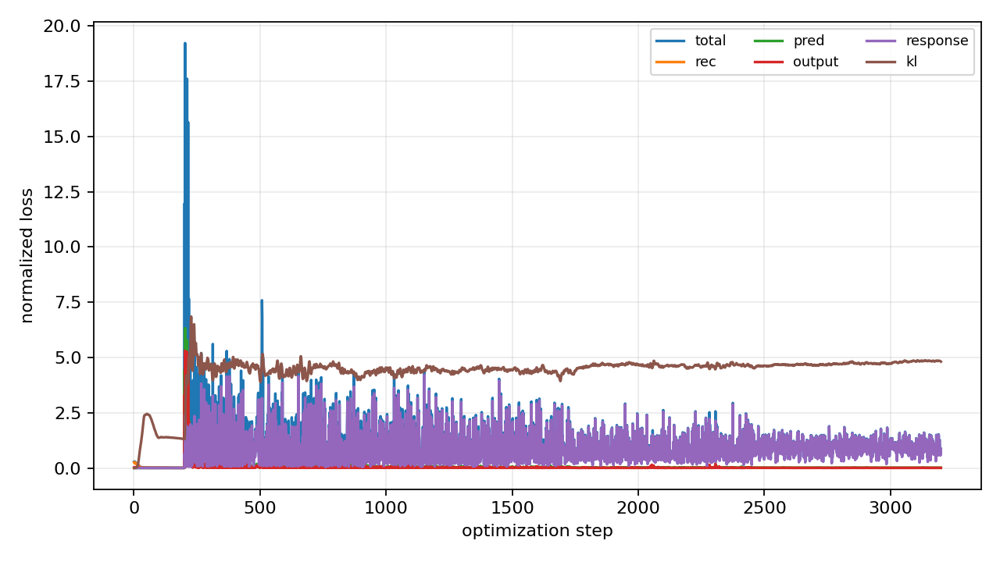
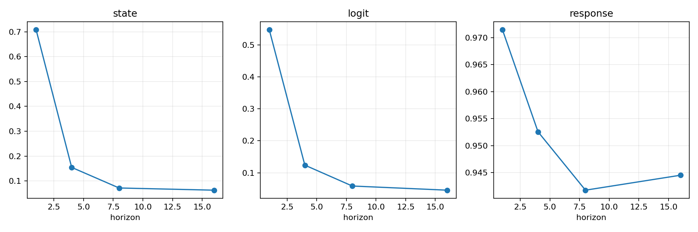
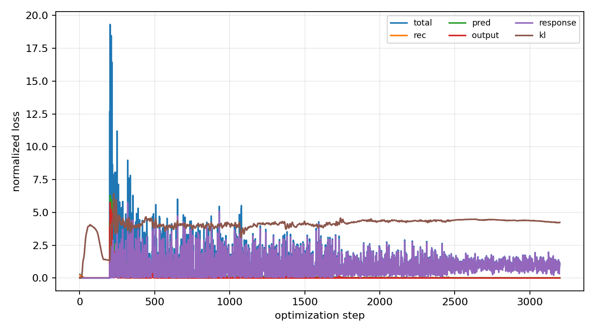
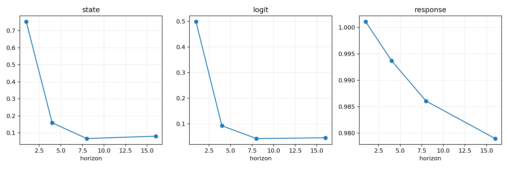

# 实验分析：V0 初始实验

> **实验状态**：已完成最小闭环 · 2026-09-08 UTC · 每个数据集选一个冻结客户端

这一页记录第一版 `VAE -> K -> decoder` 的真实运行结果。实验目的不是证明最终方法已经有效，而是先回答两个工程问题：**固定低维线性算子能否保留主图动力学，以及它是否同时保留输入扰动引起的任务响应。**

## 结论先行

| 观察 | Cora | CiteSeer | 判断 |
| --- | ---: | ---: | --- |
| 官方 A-DGN/FedAvg 配对测试 ACC | 80.27% | 76.18% | 独立 `codev0` 骨干正常，达到预期量级 |
| V0 长时距状态增量 NRMSE | 6.28% | 8.04% | 主状态轨迹可以被压缩并自由滚动 |
| V0 长时距 logit 增量 NRMSE | 4.55% | 4.58% | 冻结任务读出下的主输出轨迹较稳定 |
| V0 长时距成对响应 NRMSE | 94.45% | 97.90% | 当前代理基本没有保留扰动响应，尚不能进入联邦迁移 |

因此，V0 不是“整体成功”：**表示和主时间演化已经出现可用信号，但动态响应通道仍然失败。** 这组结果为下一步定位提供了清晰分叉：优先检查扰动响应在编码器中的可辨识性和损失尺度，再判断固定线性假设本身是否不足。

## 11 个数据集的官方基线总览

下面这张表是本次 11 个数据集的完整官方 A-DGN + FedAvg 结果。每个数据集有 10 个客户端；先在每个客户端选择验证指标最好的通信轮，再读取**同一轮**的测试指标，最后计算客户端均值和总体标准差。表中的 `ACC/AUC` 是主评价指标，`F1` 是同一最佳验证轮对应的测试 F1；百分数均为均值 ± 客户端标准差。

| 数据集 | 任务指标 | 测试主指标 | 测试 F1 | 客户端主指标范围 | 训练轮数 | 简要判断 |
| --- | --- | ---: | ---: | ---: | ---: | --- |
| Photo | ACC | **87.94 ± 7.76%** | 33.45 ± 11.40% | 74.00–98.59% | 200 | ACC 最高；客户端差异仍明显，F1 低于 ACC。 |
| Minesweeper | AUC | **87.23 ± 3.16%** | 52.85 ± 9.43% | 82.43–91.68% | 100 | AUC 高且稳定，是二分类任务中最稳的一组。 |
| PubMed | ACC | **86.57 ± 3.44%** | **73.17 ± 9.94%** | 80.40–91.32% | 100 | ACC、F1 都高，客户端间波动小，整体最均衡。 |
| Computers | ACC | 83.02 ± 10.80% | 34.84 ± 14.90% | 62.81–94.27% | 200 | 平均 ACC 较高，但客户端异质性强。 |
| Cora | ACC | 80.27 ± 11.31% | 49.76 ± 8.51% | 55.67–91.49% | 100 | 平均性能中上，客户端 ACC 波动为多分类数据集中最高之一。 |
| CiteSeer | ACC | 76.18 ± 10.24% | 37.42 ± 11.08% | 56.99–87.69% | 100 | 比 Cora 更难，客户端差异较大。 |
| Tolokers | AUC | 74.81 ± 6.56% | 32.66 ± 23.98% | 66.39–86.55% | 100 | AUC 尚可，但 F1 波动极大，阈值分类稳定性不足。 |
| Roman-empire | ACC | 70.49 ± 1.80% | 61.66 ± 2.44% | 66.38–74.19% | 100 | ACC 不高但最稳定；F1 相对较高，客户端间一致性最好。 |
| Questions | AUC | 68.76 ± 4.84% | 8.54 ± 11.75% | 60.01–76.97% | 100 | AUC 中等，但 F1 很低，说明固定阈值下正类识别困难。 |
| ogbn-arxiv | ACC | 66.42 ± 6.43% | 26.69 ± 4.74% | 57.73–75.56% | 200 | 多分类性能偏低，F1 也低，仍是较难的数据集。 |
| Amazon-ratings | ACC | **41.82 ± 5.10%** | 21.54 ± 6.72% | 34.21–48.97% | 100 | 11 个数据集中最难；平均 ACC 明显偏低。 |

### 先看整体排名

- **多分类 ACC**：Photo（87.94%）> PubMed（86.57%）> Computers（83.02%）> Cora（80.27%）> CiteSeer（76.18%）> Roman-empire（70.49%）> ogbn-arxiv（66.42%）> Amazon-ratings（41.82%）。这 8 个数据集的 ACC 简单平均为 **74.09%**，不能与 AUC 任务混合平均。
- **二分类 AUC**：Minesweeper（87.23%）> Tolokers（74.81%）> Questions（68.76%）。这 3 个数据集的 AUC 简单平均为 **76.93%**。
- **F1 不能只看主指标**：PubMed 的 F1 达 73.17%，Roman-empire 为 61.66%，而 Photo 虽然 ACC 为 87.94%，F1 只有 33.45%。Questions 的 AUC 为 68.76%，但 F1 只有 8.54%；这说明排序能力（AUC）和默认零阈值下的分类能力不是同一件事。

### 客户端异质性

客户端标准差反映同一全局训练流程在不同本地图上的不一致程度。多分类 ACC 波动最大的是 Cora（11.31 个百分点）、Computers（10.80）和 CiteSeer（10.24）；最稳定的是 Roman-empire（1.80）。二分类 AUC 中 Minesweeper 最稳定（3.16），Tolokers 更分散（6.56）。F1 的差异更突出：Tolokers 的 F1 标准差为 **23.98 个百分点**，说明 AUC 尚可并不代表所有客户端都能用同一个默认阈值取得稳定 F1。

### 逐数据集结论

| 数据集 | 结果解读 |
| --- | --- |
| **Cora** | 10 个客户端平均 ACC 80.27%，但范围从 55.67% 到 91.49%；模型总体可用，图划分造成的客户端差异不能忽略。 |
| **CiteSeer** | ACC 76.18%，低于 Cora，且标准差 10.24%；它适合作为检验异质性和鲁棒性的中等难度基线。 |
| **PubMed** | ACC 86.57%、F1 73.17%，两项都高且波动小；是当前 11 个数据集中最均衡的多分类基线。 |
| **Computers** | ACC 83.02%，但标准差 10.80%，客户端范围跨越 31.45 个百分点；平均值掩盖了显著的本地图差异。 |
| **Photo** | ACC 87.94% 为多分类最高，但 F1 仅 33.45%；后续分析不能把高 ACC 直接解释为各类别都识别良好。 |
| **ogbn-arxiv** | ACC 66.42%、F1 26.69%，整体偏难；三者都不高，说明问题不只是少数异常客户端。 |
| **Roman-empire** | ACC 70.49% 虽不高，但标准差仅 1.80%、F1 61.66%；它表现为“稳定但上限有限”，而不是剧烈客户端失配。 |
| **Amazon-ratings** | ACC 41.82%、F1 21.54%，在全部 11 个数据集中最低；应优先检查标签难度、类别分布和本地图覆盖，再讨论算法改进。 |
| **Minesweeper** | AUC 87.23%、标准差 3.16%、F1 52.85%；排序性能和阈值分类都相对可靠，是二分类中最强的基线。 |
| **Tolokers** | AUC 74.81% 尚可，但 F1 均值 32.66% 且标准差 23.98%；客户端阈值/类别不平衡问题非常明显。 |
| **Questions** | AUC 68.76% 为二分类中最低，F1 8.54% 更低；当前模型能提供有限排序信号，却难以在默认阈值下识别正类。 |

### 这些结果能说明什么，不能说明什么

本轮 11 个数据集的结论是关于**官方 A-DGN + FedAvg 基线**的，不是 V0 代理在 11 个数据集上的结果。当前 V0 代理只在 Cora 和 CiteSeer 的一个客户端上做了局部轨迹实验，尚未对另外 9 个数据集拟合代理。因此，网页中的 11 数据集表用于说明原生教师系统的任务难度和客户端异质性，不能被解读成 11 个数据集都已经完成低维动力学代理验证。

所有 11 个运行均正常结束，均使用 10 个客户端、每轮 2 个本地 epoch、官方 A-DGN 的 16 次 Euler 传播和步长 0.1；Cora、CiteSeer、PubMed、Roman-empire、Amazon-ratings、Minesweeper、Tolokers、Questions 使用 100 个通信轮，Computers、Photo、ogbn-arxiv 使用 200 个通信轮。测试指标均来自每客户端最佳验证轮的配对测试结果，而不是最后一轮结果。

## 实际算法流程

下面是本次运行真正执行的路径；代理训练完全在 `codev0` 中进行，原始 `backbone` 没有被修改，也没有接入联邦参数聚合。

<div class="experiment-flow">
<div class="experiment-flow__node"><span>01</span><strong>冻结官方 A-DGN</strong><small>最佳验证 checkpoint<br>固定图与读出</small></div>
<div class="experiment-flow__arrow" aria-hidden="true">→</div>
<div class="experiment-flow__node"><span>02</span><strong>生成完整轨迹</strong><small>特征相对扰动<br>采集 H₀...H₁₆ 与 Y₀...Y₁₆</small></div>
<div class="experiment-flow__arrow" aria-hidden="true">→</div>
<div class="experiment-flow__node"><span>03</span><strong>图变分编码</strong><small>稀疏聚合 + 注意力汇聚<br>z ~ qφ(z | H, G)</small></div>
<div class="experiment-flow__arrow" aria-hidden="true">→</div>
<div class="experiment-flow__node"><span>04</span><strong>固定 K 自由滚动</strong><small>K = I + ΔtA<br>不重编码、不读取未来态</small></div>
<div class="experiment-flow__arrow" aria-hidden="true">→</div>
<div class="experiment-flow__node"><span>05</span><strong>解码与任务评估</strong><small>Ĥ → Ŷ<br>状态、logit、响应误差</small></div>
</div>

数学对象保持为：

$$
H_{0:T}\xrightarrow{E_\phi} (\mu_{0:T},\log\sigma^2_{0:T}),\qquad
z_{a+s}=K^s z_a,\qquad
\widehat H_{a+s}=D_\psi(z_{a+s},C,S_GC),\qquad
\widehat Y_{a+s}=\mathcal O(\widehat H_{a+s}).
$$

训练时每个窗口起点只采样一次潜变量，随后用同一个 `K` 推进；验证和测试使用起点后验均值进行确定性自由滚动。图条件 `C` 来自固定参考初态，未使用时间、轨迹编号、标签或真实未来状态。

## 三个容易混淆的概念

### 1. “冻结官方 A-DGN”到底是什么意思

这里的“冻结”是**代理训练阶段的参数状态**，不是说从一个上次的代理模型继续训练，也不是说 A-DGN 从来没有训练过。完整顺序是两个彼此分开的阶段：

```text
阶段 A：从头训练官方 A-DGN/FedAvg
    随机初始化官方 A-DGN
    进行官方联邦训练（本实验配置：100 个通信轮，每轮 2 个本地 epoch）
    按原生验证协议选择最佳 checkpoint

阶段 B：训练 V0 代理
    加载阶段 A 选出的 checkpoint
    将 A-DGN、输入映射和任务 readout 设为 eval / requires_grad=False
    用这个固定 A-DGN 生成 H₀...H₁₆ 和 Y₀...Y₁₆
    代理从随机初始化开始训练：条件网络、图编码器、后验头、K 和解码器
```

因此，对“是不是先训练 A-DGN，后训练 auto encoder？”的回答是：**是，当前 V0 就是先训练官方 A-DGN，再训练代理。** 但后一个对象不是普通的 auto encoder，而是
`图编码器 -> 高斯潜态 -> 固定线性 K 多步滚动 -> 节点解码器`；它同时优化重建、自由滚动、潜态一致性、冻结 readout 输出和成对扰动响应。

阶段 B 中 A-DGN 只负责提供教师轨迹和固定任务观测。代理反向传播时，冻结 readout 的参数不更新，但 readout 对解码状态的输入梯度仍保留，所以代理仍能受到任务输出损失的训练信号。阶段 B 不会更新官方 checkpoint，也不会把代理参数放回 FedAvg。

换句话说：

| 问题 | 当前 V0 的答案 |
| --- | --- |
| A-DGN 是否从头训练？ | 是。阶段 A 从随机初始化开始；使用的是本次 baseline 选出的 checkpoint。 |
| 是否把上次训练好的代理拿来接着训练？ | 否。代理默认随机初始化，只有显式加载代理权重才会续训；本次运行没有这样做。 |
| 代理训练时 A-DGN 是否更新？ | 否。只生成并读取教师轨迹，参数和 readout 均固定。 |
| 是否联合训练 A-DGN 和代理？ | 否。联合训练是另一种实验设定，不属于当前 V0。 |

### 2. `3200 steps` 从哪里来

`3200` 是代理脚本中 Adam 的 **3200 次参数更新**，不是 A-DGN 的传播步数，不是 3200 条轨迹，也不是 `100 × 2`。A-DGN 的 16 次 Euler 传播是每条教师轨迹的时间长度；代理的 `step` 是外层优化循环次数；两者是不同层级的计数。

当前代码的默认参数在 `codev0/scripts/run_koopman_proxy_v0.py` 中：

```text
--steps 3200
--warmup 200
```

每次 optimizer step 会随机抽取最多 4 条训练轨迹和一个窗口起点；整条轨迹仍会被编码，选定窗口则用一次采样的潜态和同一个 `K` 自由滚动。按照代码 `select_horizon()` 的实际边界，3200 次被分成：

| 更新编号 | 更新次数 | 训练内容 |
| --- | ---: | --- |
| 1–200 | 200 | 编解码预热；只用重建/输出/KL 损失，预热跨度标为 1 |
| 201–950 | 750 | 联合损失，自由滚动跨度 1 |
| 951–1700 | 750 | 联合损失，自由滚动跨度 4 |
| 1701–2450 | 750 | 联合损失，自由滚动跨度 8 |
| 2451–3200 | 750 | 联合损失，自由滚动跨度 16（完整原生长度） |
| **合计** | **3200** | **200 + 4 × 750** |

日志中的 `step=1000 horizon=4`、`step=1800 horizon=8` 和 `step=3200 horizon=16` 正好对应这个实现。每 100 次更新做一次验证，但 `eval_every=100` 只是评估频率，**不会把总训练量变成 `100 × 2`**。

`100 × 2` 属于阶段 A 官方 FedAvg 的配置：100 个通信轮、每轮 2 个本地 epoch。它不参与 `3200` 的计算，也不能拿来解释代理训练时长。

### 3. 从输入到最终指标的具体数据流

对一个数据集的一个客户端，实际执行顺序如下：

1. **训练教师模型**：官方 A-DGN 从头训练，按客户端验证集选出一个 checkpoint；这一步得到的是原生分类模型，不是代理。
2. **固定教师模型**：加载 checkpoint，固定客户端图 `G`、输入映射、ODE-GNN 参数和 `readout`；原生模型只用于前向计算。
3. **生成教师数据**：保留原始特征和若干相对扰动特征 `Xδ`，分别通过固定 A-DGN，得到完整的 `H[0:T]` 与 `Y[0:T]`。本实验每个客户端分为 128/32/64 条独立训练/验证/测试轨迹，每条包含 17 个状态时刻（`T=16`）。
4. **建立静态图条件**：从固定参考初态、一次稀疏邻域聚合和节点度生成 `C` 与 `S_G C`；它们对所有轨迹共享，不携带时间、轨迹编号、标签或未来状态。
5. **代理编码**：代理编码器读取当前真实状态 `H_t`，输出 `μ_t` 和 `log σ²_t`；训练时从窗口起点后验采样一次 `z_a`。
6. **代理自由滚动**：计算 `K = I + Δt A_z`，连续执行 `z <- K z`。滚动中不重新编码、不读取真实未来 `H`，同一窗口内使用同一个 `K`。
7. **解码和监督**：解码得到 `Ĥ`，再通过冻结 `readout` 得到 `Ŷ`；损失同时比较节点状态、任务 logit、潜态对齐、各真实时刻 KL，以及基准/扰动轨迹之间的 `ΔY`。
8. **验证和测试**：用起点后验均值 `μ_0` 做确定性自由滚动，在 1/4/8/16 步分别报告状态增量 NRMSE、logit 增量 NRMSE、成对响应 NRMSE 和 argmax 一致率。只有验证集完整跨度表现用于选代理 checkpoint，测试集留到最后报告。

这条数据流可以概括为：

```text
官方 A-DGN 从头训练
        ↓ 选最佳验证 checkpoint
固定 A-DGN 生成完整教师轨迹 H, Y
        ↓
随机初始化 V0 代理训练 Eφ, Cω, K, Dψ
        ↓
H₀ → Eφ → μ₀ → K^s → Dψ → Ĥ_s → 冻结 readout → Ŷ_s
        ↓
与教师 H_s / Y_s / ΔY_s 比较并做多时距评估
```

## 实验设置

| 项目 | 实际配置 |
| --- | --- |
| 工程目录 | `codev0/`，从干净官方 `backbone/` 独立复制 |
| 数据集与客户端 | Cora client 0；CiteSeer client 0 |
| 原生骨干 | 官方 A-DGN，hidden 64，16 次 Euler，步长 0.1，gamma 0.1 |
| 扰动 | `Xδ = X ⊙ (1 + αε)`，`α ~ U(0.01, 0.05)`，每个 split 独立生成 |
| 数据划分 | train/val/test = 128/32/64 条完整轨迹，按初始条件划分后再评估 |
| 代理 | 节点条件 16 维，宽度 64，8 个 pooling query，潜维度 32 |
| 优化 | Adam，学习率 `1e-3`，3200 次代理参数更新（`200 + 4×750`），梯度范数上限 1；每 100 次更新验证 |
| 代理参数 | 65,488；其中 `A_z` 为 1,024 个参数 |
| 评估 | 每个时距分别报告 1、4、8、16 步，使用冻结读出 |

## 主轨迹结果

下表使用测试集、整批平方和后再开方，分母是原生轨迹相对初态的增量；没有逐样本除以可能接近零的增量。

| Dataset | Horizon | State NRMSE | Logit NRMSE | Response NRMSE | Argmax agreement |
| --- | ---: | ---: | ---: | ---: | ---: |
| Cora | 1 | 70.858% | 54.719% | 97.147% | 97.784% |
| Cora | 4 | 15.450% | 12.376% | 95.256% | 99.539% |
| Cora | 8 | 7.161% | 5.853% | 94.175% | 98.847% |
| Cora | 16 | 6.281% | 4.552% | 94.451% | 98.809% |
| CiteSeer | 1 | 75.306% | 49.899% | 100.110% | 97.101% |
| CiteSeer | 4 | 15.884% | 9.274% | 99.371% | 86.609% |
| CiteSeer | 8 | 6.666% | 4.285% | 98.608% | 96.014% |
| CiteSeer | 16 | 8.042% | 4.579% | 97.899% | 98.173% |

一步误差较大并不等于长程完全失败：`H_s-H_0` 在早期很小，增量归一化分母因此敏感；页面同时保留绝对响应 MAE 和长时距结果。真正稳定的负面证据是 response NRMSE 在所有时距都接近 1，且训练、验证、测试表现相近，说明不是单纯过拟合。

## 训练日志

完整逐步日志保存在：

- `codev0/run_logs/proxy_v0/Cora_client0/training.jsonl`
- `codev0/run_logs/proxy_v0/CiteSeer_client0/training.jsonl`

关键节点摘录如下：

```text
Cora      step=0100 horizon=1  loss=0.01553 val_score=13.28260
Cora      step=1000 horizon=4  loss=1.30600 val_score=6.74012
Cora      step=1800 horizon=8  loss=0.37119 val_score=6.22061
Cora      step=3200 horizon=16 loss=0.86521 val_score=5.64806

CiteSeer  step=0100 horizon=1  loss=0.00760 val_score=13.13935
CiteSeer  step=1000 horizon=4  loss=1.55876 val_score=8.85797
CiteSeer  step=1800 horizon=8  loss=0.53821 val_score=7.04630
CiteSeer  step=3200 horizon=16 loss=1.00247 val_score=5.67805
```

`val_score` 用于验证集上的状态、logit 和 response 联合选择；最终模型的全部指标见上表和 `metrics.json`。这样最佳 checkpoint 不会回避响应通道的失败。

## 可视化证据

### Cora

<figure markdown="span">
  { width="100%" }
  <figcaption>训练过程中总损失、重建、预测、输出、响应和 KL 项的变化。</figcaption>
</figure>

<figure markdown="span">
  { width="100%" }
  <figcaption>不同自由滚动时距的状态、logit 和 response 测试误差。</figcaption>
</figure>

### CiteSeer

<figure markdown="span">
  { width="100%" }
  <figcaption>CiteSeer 的 V0 训练损失记录。</figcaption>
</figure>

<figure markdown="span">
  { width="100%" }
  <figcaption>CiteSeer 不同自由滚动时距的测试误差。</figcaption>
</figure>

## 工程核验与复现

官方基线由 `codev0/scripts/run_official_adgn_all11.sh Cora CiteSeer` 生成，日志记录在 `codev0/run_logs/official_adgn_k16_all11_20260908_040956/`。代理使用：

```bash
/root/anaconda3/envs/torch/bin/python codev0/scripts/run_koopman_proxy_v0.py --dataset Cora --client-id 0 --device cuda:0 --output codev0/run_logs/proxy_v0/Cora_client0
/root/anaconda3/envs/torch/bin/python codev0/scripts/run_koopman_proxy_v0.py --dataset CiteSeer --client-id 0 --device cuda:1 --output codev0/run_logs/proxy_v0/CiteSeer_client0
```

工程测试覆盖：原生最终读出一致性、固定矩阵重复传播、冻结读出仍可向代理传递输入梯度，以及联合节点置换一致性。代理不修改原生模型参数，也不使用大图 Laplacian、邻接矩阵或节点特征矩阵的 SVD。

每次运行的 checkpoint、partition SHA-256、张量形状和参数量写入对应的 `metadata.json`；本次两组轨迹形状分别为 Cora `[128/32/64, 17, 244, 64]` 和 CiteSeer `[128/32/64, 17, 207, 64]`。

## 失败归因与下一步

当前最可信的结论是：**V0 的压缩表示可以承载主轨迹，但现有训练目标没有让潜态显式承载小幅输入扰动的差分方向。** 不能仅凭主状态误差低就进入知识运输。

基于这一结果，主线已转向 [Method V0.1](../methodv01.md)：让低维线性图动力学直接成为 GNN 传播层，从真实标签端到端训练，先检验其任务容量与收敛效率。下面的诊断仍用于解释 V0 的失败，不再作为启动 V0.1 之前的阻塞项。

下一轮按以下顺序排查：

1. 单独报告 `||ΔY||`、代理 `||ΔŶ||` 和响应绝对误差，确认 response 项是否被小扰动尺度或基准广播方式主导。
2. 加入 response-only/linearized response 诊断，直接检查 `E(H^δ)-E(H^0)` 是否随扰动变化，而不是只看最终读出。
3. 用同一表示比较恒等演化、冻结表示非线性转移和联合非线性转移，区分表示瓶颈与固定线性 `K` 瓶颈。
4. 只有 response 通道通过后，才把多个客户端的潜坐标运输、守恒流和异质性能量接回主线。
