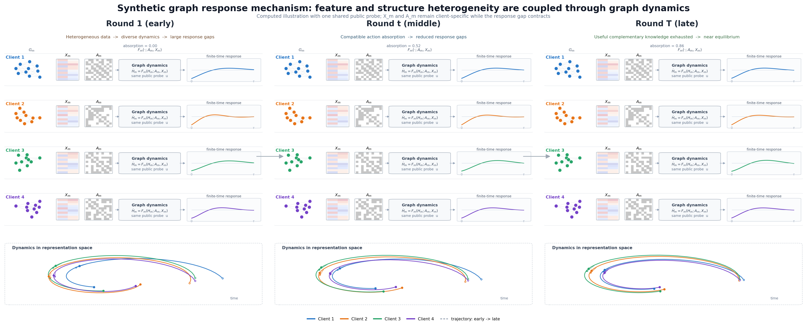

Graph Dynamics Research Workspace

# 图动力学算法设计

从异质图传播轨迹中学习可解释、可验证、可迁移的动力学知识。

[进入 Method V0.2](methodv02.md){ .md-button .md-button--primary }
[回看 Method V0.1](methodv01.md){ .md-button }
[回看 Method V0](methodv0.md){ .md-button }
[查看实验分析](experiments/index.md){ .md-button }
[浏览参考论文](references/index.md){ .md-button }

<strong>03</strong>方法版本

<strong>04</strong>核心参考论文

<strong>01</strong>初始实验

<strong>01</strong>固定研究主线

## 工作区

CURRENT METHOD

### [Method V0.2](methodv02.md)

联合训练非线性参考轨迹与节点级 E–K–D，将解码器接入分类并检验多步演化。已进入 Cora 完整 100 轮联邦验证；实验页区分本地诊断、客户端验证选模和最终全局成绩，尚未证明表达能力提升。

[查看 V0.2 实现](methodv02.md){ .md-button .md-button--primary }
[查看联邦与本地实验](experiments/methodv02.md){ .md-button }

EVIDENCE BASE

### [Method V0](methodv0.md)

冻结 A-DGN 后拟合本地 Koopman 代理。V0 已验证主轨迹可以低维滚动，也暴露了扰动响应没有被保留的问题。

[回看 V0](methodv0.md){ .md-button }

READING LIBRARY

### [参考论文](references/index.md)

按“坐标学习 → 变分压缩 → 滚动纠偏 → 算子适配”组织四篇 Koopman 论文，逐篇记录方法和面向异质图联邦的启发。

[打开论文库](references/index.md){ .md-button }

MAINTENANCE

### [维护说明](guide/authoring.md)

统一维护 Markdown、LaTeX、图片、交互脚本和本地预览环境，后续算法方案可以直接追加页面。

[查看维护规范](guide/authoring.md){ .md-button }

## 当前研究主线

01<strong>节点潜坐标</strong><small>输入与邻域 → 节点编码器</small>

→

02<strong>线性图传播</strong><small>自身与邻域生成元 → 多步演化</small>

→

03<strong>真实任务验证</strong><small>ACC/AUC 与收敛轮数</small>

→

04<strong>动力学共享</strong><small>坐标对齐后再缩小通信对象</small>

## 一个可交互的线性动力学示例

下面的示例直接在 Markdown 页面中嵌入 HTML 和 JavaScript。拖动时间步，观察二维
潜态在固定线性算子下的轨迹；算法页面可以用同样方式嵌入实验图、参数滑块、
Canvas、SVG 或其他前端组件。

  

    <label for="demo-horizon">传播步数 <output data-horizon>12</output></label>
    <input id="demo-horizon" data-horizon-input type="range" min="0" max="32" value="12">
  

  <canvas data-dynamics-canvas width="900" height="320" aria-label="二维潜态线性动力学轨迹"></canvas>
  

## 页面能力

| 内容 | 写法 | 用途 |
| --- | --- | --- |
| 数学公式 | LaTeX 的 `$...$` 或 `$$...$$` | 定义动力系统、损失函数和约束 |
| 图片 | Markdown 图片或 HTML `figure` | 放置机制图、实验图和截图 |
| 布局 | Markdown 网格、属性和少量 HTML | 组织模块卡片、对照实验和结果 |
| 交互 | 页面中的 HTML + `docs/javascripts/` | 滑块、动画、Canvas、可视化组件 |
| 代码 | fenced code block | 展示实现和伪代码 |

例如，线性潜空间传播可以直接写成：

$$
z_{t+1}=Kz_t, \qquad \widehat{H}_{t+s}=D_\psi(K^s z_t, G).
$$

<figure markdown="span">
  { width="100%" }
  <figcaption>本地图片会随站点一起构建，不依赖外部图片链接。</figcaption>
</figure>
