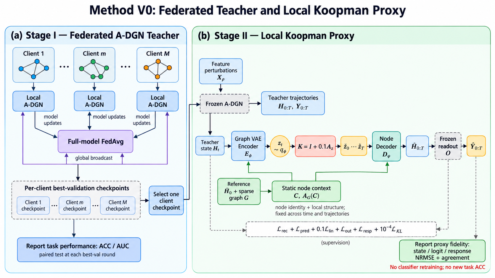

# Method V0：在 ODE-GNN 上学习低维线性动力学代理

版本：2026-09-08 UTC · V0 已在 `codev0/` 实现并完成 Cora/CiteSeer 初始验证；结果见[实验分析](experiments/index.md)。

[查看代码实现流程](methodv0-implementation.md){ .md-button .md-button--primary }
[查看实验分析](experiments/index.md){ .md-button }
[进入下一版 V0.1](methodv01.md){ .md-button }

!!! info "V0 的结论边界"
    V0 支持“主要隐藏轨迹可以低维线性化”，尚未支持“代理已保留可迁移的扰动动力学”。下一版采用[单阶段低维线性图动力学](methodv01.md)，直接检验这一结构能否完成真实任务并取消成熟教师的前置依赖。

**V0 的核心设计是：先固定一个已训练的 ODE-GNN，用它的传播轨迹训练一个旁路代理；代理把整图状态编码为一个低维向量，使用同一个线性矩阵连续推进，再解码为节点状态。** 主干负责提供真实动力学与冻结任务读出，新增分支负责学习这段动力学的压缩表示。当前实现保持旁路和本地单客户端边界，尚未进入跨客户端知识运输。

<figure markdown="span">
  { width="100%" }
  <figcaption>阶段一的 ACC/AUC 来自官方 A-DGN/FedAvg；阶段二选择一个客户端 checkpoint，只在本地训练代理并报告轨迹保真度。</figcaption>
</figure>

## 1. 整体框架：主干产生轨迹，代理学习演化


训练时，主干产生 $H_0,H_1,\ldots,H_T$；代理既对这些状态进行编解码，也从某个起点的潜态自由预测之后的状态。真实未来状态只进入监督路径，自由预测路径的中间状态全部由 $K$ 产生。预测时只需要输入初始状态、已缓存的本地图条件和目标步数，即可得到代理状态与任务输出。

$$
\underbrace{(X,G)\xrightarrow{\mathrm{ODE\text{-}GNN}}H_{0:T}}_{\text{冻结的轨迹来源}},\qquad \underbrace{H_a\xrightarrow{E_\phi}z_a\xrightarrow{K^s}\widehat z_{a+s}\xrightarrow{D_\psi}\widehat H_{a+s}\xrightarrow{\mathcal O}\widehat Y_{a+s}}_{\text{新增的低维代理分支}}.
$$

| 模块 | 本轮选定的初步方案 | 学习或更新什么 |
| --- | --- | --- |
| ODE-GNN backbone | 沿用现有官方 A-DGN 与固定 Euler 步长，选定检查点后冻结。 | 代理训练期间不更新主干、输入映射和读出参数。 |
| 本地图条件 | 从固定参考初态和稀疏图邻域生成每节点 16 维条件，所有轨迹共用。 | 条件网络与代理共同训练；训练后缓存节点条件。 |
| 图状态编码器 | 共享节点网络、一次稀疏消息聚合、8 个学习查询的注意力汇聚，再输出高斯后验。 | 学习哪些节点与通道组合能够描述动力学。 |
| 线性代理算子 | 一个客户端、一个冻结系统对应一个 $K\in\mathbb R^{r\times r}$，初始 $r=32$。 | 直接与编解码器联合优化，一次预测中复用同一个矩阵。 |
| 节点状态解码器 | 将全局潜态与静态节点条件融合，通过共享 MLP 恢复各节点状态。 | 学习潜态对应的节点状态，参数量不随节点数增长。 |
| 训练与评估 | 训练传播潜样本，评估采用后验均值作为确定性起点；覆盖多个预测跨度。 | 联合优化重建、预测、潜态一致性、任务响应和各时刻 KL。 |

这里的 $r=32$ 表示**整张客户端图的动态潜态只有 32 维**，而不是每个节点各有 32 维。静态节点条件仍需本地保存，其成本与模型参数一起报告。

## 2. 主干接口：具体代理哪一个动力系统

客户端图固定为 $G$，规范化稀疏传播矩阵记为 $S_G$，节点状态为 $H_t\in\mathbb R^{n\times d}$。当前 A-DGN 的原生传播可以写为下式，具体转置约定、归一化和偏置均以现有实现为准：

$$
H_0=\operatorname{Embed}_{\theta}(X),\qquad H_{t+1}=H_t+\Delta t\,\tanh\!\left(H_t(W-W^\top-\gamma I)^\top+S_GH_tV^\top+b\right),\qquad Y_t=\mathcal O(H_t).
$$

$\mathcal O$ 直接使用冻结模型的 `readout`。当前代码的默认配置为 $d=64$、$T=16$、$\Delta t=0.1$；实验读取所选检查点对应的真实配置，不覆盖它。读取中间状态可复用 `encode_native_dynamics_states(data)`，并验证最后状态经原生读出后与模型输出一致。

新增代理作为独立模块接收分离计算图后的轨迹。主干采集使用 `no_grad`；计算代理输出损失时，冻结读出的参数但保留它对输入的梯度，以便损失仍能传回解码器。原有分类训练、FedAvg 聚合、持久优化器状态与最佳验证模型协议均保持原有行为，新增代理暂不进入客户端上传或服务端聚合。

## 3. 低维表示：用图条件区分节点，用一个潜态描述变化

### 3.1 为一个冻结系统建立固定参考

取原始本地图特征对应的初态 $\bar H_0$ 作为参考，后续所有训练、验证和测试轨迹都使用同一个参考。这里的参考只提供静态节点信息，不跟随某条扰动轨迹改变，也不包含任何未来状态或标签。采用两层共享 MLP 生成节点条件：

$$
C=\operatorname{MLP}_{\omega}\!\left([\bar H_0,S_G\bar H_0,\log(1+\deg_G)]\right)\in\mathbb R^{n\times c},\qquad c=16.
$$

条件网络宽度为 64，输出维度为 16，隐藏层使用 SiLU。训练过程中它随代理参数一起更新，但同一批次内对所有时刻与轨迹共用；模型冻结后缓存 $C$ 和 $S_GC$，预测时复用。它们告诉解码器“这是图中的哪个特征与结构环境”，动态变化则必须通过 $z$ 传递。解码器不读取步数 $t$、某条轨迹的完整初态副本或真实未来态。

### 3.2 将变长图状态编码成固定维潜态

先把当前节点状态与静态条件拼接，经共享节点映射和一次稀疏邻域聚合得到 $U_t\in\mathbb R^{n\times w}$，其中 $w=64$：

$$
U_t^{(0)}=\operatorname{SiLU}([H_t,C]W_0+b_0),\qquad U_t=\operatorname{SiLU}\!\left(U_t^{(0)}W_{\mathrm{self}}+S_GU_t^{(0)}W_{\mathrm{nbr}}+b_1\right).
$$

设置 $p=8$ 个学习得到的查询向量 $q_j\in\mathbb R^w$，每个查询在节点维做注意力汇聚。与先固定状态投影基不同，这些查询和编码网络通过后续动力学损失共同学习：

$$
\alpha_{t,j,i}=\frac{\exp(q_j^\top U_{t,i}/\sqrt w)}{\sum_{v=1}^{n}\exp(q_j^\top U_{t,v}/\sqrt w)},\qquad v_{t,j}=\sum_{i=1}^{n}\alpha_{t,j,i}U_{t,i},\qquad v_t=\operatorname{concat}(v_{t,1},\ldots,v_{t,p}).
$$

用两个线性头将 $v_t\in\mathbb R^{pw}$ 映射为均值与对数方差，形成全图后验。实现时对对数方差作有限范围限制，例如 $[-8,4]$，避免采样数值溢出：

$$
q_\phi(z_t\mid H_t,G,C)=\mathcal N\!\left(\mu_t,\operatorname{diag}(\sigma_t^2)\right),\qquad z_t=\mu_t+\sigma_t\odot\epsilon_t,\qquad \epsilon_t\sim\mathcal N(0,I_r).
$$

编码器中的共享节点运算和对称汇聚使图级潜态对联合节点重编号保持不变。查询序号定义本地潜表示的一部分，它不构成不同客户端之间已经对齐的公共坐标。

### 3.3 从潜态恢复节点状态

将同一个全局潜态广播到各节点，与该节点的静态条件及其邻域条件拼接，使用两层共享解码器恢复节点状态，结构为 $(r+2c)\rightarrow64\rightarrow d$，隐藏层使用 SiLU，输出层为线性层：

$$
\widehat H_{t,i}=\operatorname{MLP}_{\psi}\!\left([z_t,C_i,(S_GC)_i]\right),\qquad \widehat Y_t=\mathcal O(\widehat H_t).
$$

节点条件随图同步置换，因此解码输出也应同步置换。该结构的限制也明确：如果两个节点的静态条件完全相同，它们在给定同一个 $z$ 时会得到相同输出；不能据此保证任意图和任意节点扰动都可重建。V0 将通过重建和响应诊断检查这一限制是否成为实际瓶颈。额外设置打乱潜态或将潜态固定为常数的对照，确认解码器没有只靠静态条件输出平均轨迹。

## 4. 线性动力学：先联合学习一个固定 K

### 4.1 参数化与自由滚动

采用直接联合优化，避免第一版同时引入闭式回归、元学习或状态条件算子。将离散算子参数化为接近恒等映射的矩阵，$A_z$ 为不加结构限制的可训练参数，初始元素取小幅随机值，例如标准差 $10^{-3}$：

$$
K=I_r+\Delta t A_z,\qquad \widehat z_{a+s}=K^s z_a,\qquad \widehat H_{a+s}=D_\psi(\widehat z_{a+s},C,S_GC).
$$

这是一种残差式线性参数化，未声称学到的 $A_z$ 就是原系统的精确连续生成元。$K$ 不接收当前状态、时间步或轨迹编号，同一客户端的不同初始条件共享同一个 $K$。图与主干参数变化后，需要重新识别或更新该代理，第一版不处理这种在线变化。

不把主干的反对称参数形式直接强加给 $K$：高维非线性系统经压缩后未必保留相同结构。先监测多步误差、$\|K^s\|$ 与扰动增长，判断是否出现虚假放大或过度收缩，再决定是否需要稳定性约束。

### 4.2 概率语义：训练传播同一个样本，预测使用均值起点

在每个训练窗口 $H_{a:a+L}$ 中，从起点后验采样一次 $z_a$，随后使用同一个 $K$ 推进该样本；中途不重新采样、不读取真实未来状态，也不把真实未来态编码替换进预测链。窗口的条件生成模型可以写成：

$$
p(z_a)=\mathcal N(0,I_r),\qquad p(H_{a:a+L}\mid z_a,C)=\prod_{s=0}^{L}\mathcal N\!\left(H_{a+s};D_\psi(K^sz_a,C,S_GC),\tau_H^2I\right).
$$

这里的高斯观测对向量化的节点状态定义。起点编码器是该窗口的变分推断网络；采用高斯观测后，期望重建与预测误差对应负对数似然项。训练在轨迹的各个可用起点重复这种窗口目标，并增加潜态一致性与任务响应监督，故整体称为**窗口级 β-VAE 加动力学辅助损失**，不将它宣称为某个完整长轨迹联合模型的精确 ELBO。

所有真实时刻的编码后验均参加 KL 约束，而不只约束 $t=0$。这借鉴 B-NODE 的全时段容量控制思想，但没有照搬其分布参数 ODE。预测潜样本的协方差一般是稠密的：

$$
\widehat\mu_{a+s}=K^s\mu_a,\qquad \widehat\Sigma_{a+s}=K^s\operatorname{diag}(\sigma_a^2)(K^s)^\top.
$$

V0 通过采样隐式传播这一分布，不在每一步把它强行改回对角形式。确定性评估使用 $D_\psi(K^s\mu_a,C,S_GC)$，这是均值潜态的解码结果；它通常不等于非线性解码后的预测均值。概率校准不作为第一版的主要结论。

## 5. 训练目标：重建好还要预测对、响应对

### 5.1 五类保真目标与一个信息约束

以下 $\operatorname{NMSE}$ 表示先对节点和通道取均方，再除以对应信号在训练集上的固定尺度；不对每条测试轨迹重新估计归一化量。定义当前状态的样本重建为 $\widetilde H_a=D_\psi(z_a,C,S_GC)$，未来状态由同一个样本自由滚动获得。

$$
\begin{aligned}
\mathcal L_{\mathrm{rec}}&=\mathbb E_{a,\epsilon}\operatorname{NMSE}_H(\widetilde H_a,H_a),\\
\mathcal L_{\mathrm{pred}}&=\mathbb E_{a,s,\epsilon}\operatorname{NMSE}_H(\widehat H_{a+s},H_{a+s}),\\
\mathcal L_{\mathrm{lin}}&=\mathbb E_{a,s}\frac{1}{r}\|K^s\mu_a-\mu_{a+s}\|_2^2,\\
\mathcal L_{\mathrm{out}}&=\mathbb E_{a,s,\epsilon}\operatorname{NMSE}_Y\!\left(\mathcal O(\widehat H_{a+s}),\mathcal O(H_{a+s})\right).
\end{aligned}
$$

对基准初值与扰动初值生成的一对轨迹，令 $\Delta Y_s=Y_s^\delta-Y_s^0$，并让两条代理轨迹分别从自身初态自由滚动，计算预测差异 $\Delta\widehat Y_s$。这一项检验代理是否保留系统对输入变化的作用，而不只是复现一个平均输出。

$$
\mathcal L_{\mathrm{resp}}=\mathbb E_{\delta,s,\epsilon}\operatorname{NMSE}_{\Delta Y}(\Delta\widehat Y_s,\Delta Y_s),\qquad \mathcal L_{\mathrm{KL}}=\mathbb E_{\text{轨迹},t}\frac{1}{2r}\sum_{j=1}^{r}\left(\mu_{t,j}^2+\sigma_{t,j}^2-\log\sigma_{t,j}^2-1\right).
$$

成对预测可共用标准高斯噪声 $\epsilon$ 来减少差分估计的采样方差，每个条件后验的边缘分布仍保持正确。基准参考轨迹只由原始本地输入产生，验证或测试扰动的未来状态只用于各自的评估。初始权重取下式，作为首版配置而非已调优参数：

$$
\mathcal L=\mathcal L_{\mathrm{rec}}+\mathcal L_{\mathrm{pred}}+0.1\mathcal L_{\mathrm{lin}}+\mathcal L_{\mathrm{out}}+\mathcal L_{\mathrm{resp}}+10^{-4}\mathcal L_{\mathrm{KL}}.
$$

状态与输出尺度使用训练轨迹相对训练均值的均方变化量，响应尺度使用训练集成对输出差的均方量，均设置 $10^{-8}$ 的数值下界。若响应尺度接近该下界，应同时报告绝对误差并说明该初值范围没有充分激励任务响应。KL 使用各真实时刻的编码分布；潜态多步一致性将这些编码与自由滚动联系起来，但不据此承诺每个预测通道都已严格闭合。

### 5.2 一个训练批次的执行顺序

```text
输入：一批完整训练轨迹 H[0:T]、冻结读出、固定参考 H̄0 与图 G
1. 由条件网络计算 C 与 S_G C；所有轨迹和时刻共用。
2. 编码 H[0:T]，得到每个时刻的 μ、log σ²；计算全时段 KL。
3. 对每个有效起点 a，采样一次 z_a，并计算当前状态重建。
4. 从 z_a 出发反复执行 z ← Kz，直到当前训练跨度或轨迹末尾。
5. 解码预测潜态，计算多步状态、潜态对齐与冻结读出误差。
6. 从基准与扰动的 H0 各自滚动，计算成对任务响应误差。
7. 合并并归一化损失，只更新条件网络、编码器、K 和解码器。
输出：更新后的本地代理；主干检查点与原生分类路径保持原状。
```

当前实现的默认训练预算是 **3200 次代理参数更新**，不是 A-DGN 的传播步数，也不是官方 FedAvg 的 `100 轮 × 2 个本地 epoch`。其中前 200 次是编解码预热；代码随后将剩余 3000 次平均分为四段，每段 750 次，依次使用自由预测跨度 1、4、8、$T$，因此实际分段为 `200 + 750 + 750 + 750 + 750 = 3200`。整段真实状态始终参与编码与 KL，只有自由预测跨度逐步增加。Adam 学习率初取 $10^{-3}$，当前脚本默认批大小为 4 条轨迹，梯度范数上限 1；每 100 次更新进行验证，只在最终完整跨度阶段选择最佳模型。

这里的阶段边界来自 `codev0/scripts/run_koopman_proxy_v0.py::select_horizon`：预热为更新 1--200，之后按 1/4、4/8、8/16 和 16/$T$ 的四个等长区间切换。官方 A-DGN 的训练必须先独立完成：从头训练并按原生验证协议选 checkpoint；代理阶段加载该 checkpoint 后固定主干，只更新条件网络、编码器、$K$ 和解码器。当前 V0 不做 A-DGN 与代理的端到端联合反向传播。

验证选择使用确定性均值起点，从 $H_0$ 自由滚动，按所有有效评估时距的状态、输出和响应归一化均方误差之和选择模型；不以 KL 大小或一步回归误差替代预测质量。

## 6. 最小实验：先区分表示瓶颈与线性假设瓶颈

### 6.1 数据与初始配置

| 项目 | 初步配置 |
| --- | --- |
| 系统范围 | 先选 Cora 与 CiteSeer 的一个客户端，各自使用按既有验证协议选定的冻结主干；分别拟合代理。 |
| 轨迹生成 | 固定图和参数，仅对输入特征作相对扰动，再经冻结输入映射得到初态；不改变传播方程。 |
| 扰动规则 | $X^\delta=X\odot(1+\alpha\epsilon)$，$\epsilon$ 元素独立服从标准高斯，$\alpha$ 在 $[0.01,0.05]$ 均匀采样；零特征保持为零。 |
| 数据划分 | 每个系统新生成 128 条训练、32 条验证、64 条测试轨迹；按初始条件独立划分后再裁窗口。 |
| 随机性 | 数据生成种子分别固定为 101、202、303；代理初始化种子为 11、23、37，所有对照共用相同数据。 |
| 默认结构 | $r=32$、节点条件 $c=16$、节点网络宽度 $w=64$、注意力查询数 $p=8$；原生传播长度从配置读取。 |
| 评估跨度 | $\{1,4,8,T\}$ 中不超过 $T$ 的值去重；主要预测从初态自由滚动，另报告中间起点诊断。 |

这些数量是待执行的首版设计，不是已有实验结果。独立逐元素扰动未预设低秩状态基，因此 $r=32$ 是否足够必须通过数据检验；若表示重建已经明显失败，应先检查容量与节点条件，不把后续预测失败全部归因于 $K$。允许在验证集上增加一次 $r=64$ 容量诊断，模型结构与预算随之重新记录，测试集仍保留到最终选择后使用。

### 6.2 对照及其归因用途

| 对照 | 保持什么一致 | 要回答的问题 |
| --- | --- | --- |
| 真实状态编解码 | 使用最终训练的同一编码器与解码器，输入各真实时刻状态。 | 状态或任务响应是否在压缩时已经丢失？这是重建诊断，不计作预测成绩。 |
| 恒等演化 $K=I$ | 在最终代理中仅把演化替换为恒等映射，保留编解码器。 | 学到的时间演化是否优于“潜态保持不变”？ |
| 无变分瓶颈的确定性 AE + K | 同结构、同初始化预算，改用 $z=\mu$、去掉 KL 并重新训练。 | 采样与容量正则是否在当前维度损害保真？这同时改变了采样和 KL，应整体解释。 |
| 冻结表示 + 非线性潜转移 | 冻结主模型的条件网络与编解码器，只重新训练潜转移。 | 同一表示下，放宽线性假设是否带来改善？ |
| 同预算联合非线性模型 | 保持编解码结构、潜维度与更新次数，联合训练非线性转移。 | 表示与非线性演化共同调整后，是否更容易满足同一预测目标？ |
| 潜态固定或轨迹间打乱 | 保持静态条件和解码器，仅固定或置换整条轨迹的潜态序列。 | 解码输出是否确实依赖对应轨迹的动态潜态？ |

非线性转移统一采用 $F_\eta(z)=z+\Delta t\,W_2\tanh(W_1z)$，不额外添加线性分支或偏置，隐藏宽度取 $r/2$。这样 $W_1$ 与 $W_2$ 合计 $r^2$ 个参数，与线性模型的 $A_z$ 相同，维度为偶数时可直接匹配。两者表达能力和计算开销仍不同，故同时记录耗时；“冻结同一表示”的对照和“联合重训”的对照分开解释。

这个预算匹配的非线性模型不包含所有满秩线性映射，因此它若显著改善预测，可以支持固定线性假设受限的解释；它若没有改善，不能反过来证明线性假设充分。若归因仍不清楚，再增设保留 $Kz$ 的非线性残差转移，并明确报告增加的参数，避免把对照模型自身的容量限制误认为研究结论。

### 6.3 判定标准与失败后下一步

首版报告状态增量、logit 增量、成对任务响应的 NRMSE，以及相对冻结主干的节点 argmax 一致率。以整个测试集合的均方量计算分子和分母后开方，避免将接近零的小响应逐样本相除；状态增量以真实 $H_s-H_0$ 为归一化参照，logit 增量与响应分别使用各自真实差分。每个时距单独报告，响应接近零时并列绝对误差。

为明确指标口径，状态与 logit 指标的分子均采用预测值相对真实值的误差，分母采用真实时间增量，不能用预测初态的偏移抵消预测误差。令 $\rho$ 遍历测试轨迹，则状态指标为下式；logit 指标将 $H$ 换成 $Y$，成对响应指标将其换成 $\Delta Y$，且响应分母直接使用 $\Delta Y_s$ 的平方和。

$$
e_H(s)=\sqrt{\frac{\sum_{\rho}\|\widehat H_s^{\rho}-H_s^{\rho}\|_F^2}{\sum_{\rho}\|H_s^{\rho}-H_0^{\rho}\|_F^2+\varepsilon}}.
$$

初步工作门槛为：所有评估时距的状态与 logit 增量 NRMSE 不高于 10%，成对响应 NRMSE 不高于 20%，argmax 一致率不低于 98%。这组数值是用于筛查候选的工程标准，不是理论常数；在读测试结果前固定。还需检查三个初始化的波动，以及动态潜态被打乱后的响应误差是否明显变差。

若编解码诊断已经失败，优先调整节点条件、表示容量或采样范围；若重建可用、同表示非线性转移可用而线性转移失败，则固定线性假设受到挑战；若所有预测器均失败，还需检查训练覆盖、优化与状态定义。只有局部代理保真得到支持以后，再讨论周期重编码、在线算子适配或跨客户端比较。

## 7. 成本核算与接入位置

按上文明确的线性层和偏置配置，$d=w=64$、$c=16$、$p=8$、$r=32$ 时，条件网络约 9,360 个参数，编码器与两个后验头约 46,784 个参数，解码器 8,320 个参数，$A_z$ 为 1,024 个参数，总计 **65,488 个可训练参数**，约 256 KiB 的 float32 权重。该估算不含主干、优化器状态与临时激活；$K$ 的 4 KiB 只是其中一部分。

冻结后缓存 $C$ 和 $S_GC$ 需要 $2nc$ 个浮点数，即每节点约 128 字节；例如 $n=250$ 时约 31.25 KiB。训练还要保留参考初态、稀疏图和轨迹数据。单步潜演化的成本为 $O(r^2)$，编码需要一次遍历节点和边，完整节点解码仍随 $n$ 增长。因此分别报告采集、代理训练、缓存构建、单独潜演化和包含解码的完整预测耗时，不能仅凭小矩阵宣称端到端加速或低通信成本。

| 现有或计划位置 | 接入方式 |
| --- | --- |
| 官方 A-DGN | 作为原生行为来源，V0 不改它的演化方程与参数。 |
| 模型封装 | 复用 `encode_native_dynamics_states` 与冻结 `readout`，以原生轨迹校验采集结果。 |
| `codev0/proxy/graph_koopman_v0.py` | 实现条件网络、图编码器、线性潜转移、共享节点解码与损失；保持在旁路本地训练。 |
| `codev0/scripts/run_koopman_proxy_v0.py` | 独立加载图与检查点，生成整轨迹划分，拟合代理，导出指标与配置。 |
| `codev0/tests/test_koopman_proxy_v0.py` | 检查原生输出保持、联合置换一致性、梯度边界及手工小矩阵多步传播。 |

上述路径位于从干净 `backbone/` 复制出的 `codev0/`，已存在可运行实现。记录配置、数据种子、检查点哈希、代理权重、静态条件和验证选型依据，保证另一个会话能从文件复现实验。

## 8. V0 应交付的算法对象

V0 交付一个本地代理 $\mathcal P_m=(E_m,K_m,D_m,C_m,S_{G_m}C_m)$，以及它在指定冻结系统、初始条件范围和传播长度内的验证报告。当前实现已完成图编解码、样本传播和联合学习固定 $K$；初始实验支持主状态轨迹压缩，但响应保真仍未通过，因此下一步先做响应方向与演化模型诊断，再决定是否进入联邦知识迁移。
