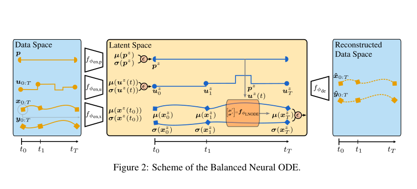

# Balanced Neural ODEs：Nonlinear Model Order Reduction and Koopman Operator Approximations

**作者**: Julius Aka, Johannes Brunnemann, Jörg Eiden, Arne Speerforck, Lars Mikelsons  
**会议/期刊**: ICLR 2025  
**arXiv**: [2410.10174](https://arxiv.org/abs/2410.10174)  
**代码**: [juliusaka/balanced-neural-odes](https://github.com/juliusaka/balanced-neural-odes)  
**领域**: 变分降阶、神经 ODE、Koopman 近似  
**关键词**: beta-VAE, latent ODE, model order reduction, information bottleneck

{ width="100%" }

<figcaption class="figure-caption">原论文 Figure 2 的框架截取：数据空间中的状态、输入和参数先进入潜空间，潜分布参数沿时间演化后再解码。</figcaption>

## 一句话总结

论文把 VAE 的信息压缩和 Neural ODE 的时间演化结合起来，让潜变量的均值与方差
在完整轨迹上持续受到约束，并可将潜向量场替换成线性结构以获得 Koopman 近似。

## 研究背景与动机

- **领域现状**：Neural ODE 擅长拟合连续时间轨迹，VAE 擅长学习低维随机表示，传统降阶方法则依赖人工或线性基底。
- **现有痛点**：普通 Latent ODE 可能只在初态形成瓶颈，外部输入和后续动力学又重新占用全部潜通道。
- **核心矛盾**：要同时保留瞬态响应和压缩状态维度，单纯降低 latent size 可能损害预测，单纯重建又不会产生有效降阶。
- **本文目标**：在受输入驱动的系统中学习可调复杂度的降阶模型；识别并验证真正承载信息的潜维度。
- **切入角度**：把 KL 信息约束放到整条轨迹的潜分布，而不是只约束初始编码。
- **核心 idea**：让没有必要传递动力学信息的通道回到先验噪声，使模型被迫使用较少的有效状态维度。

## 方法详解

### 整体框架

一条样本包含状态 \(x_{0:T}\)、输入 \(u_{0:T}\)、物理参数 \(p\) 和输出
\(y_{0:T}\)。不同信息源分别编码成高斯潜变量：

$$
(\mu_0^x,\sigma_0^x)=E_x(x_0),\quad
(\mu_t^u,\sigma_t^u)=E_u(u_t),\quad
(\mu^p,\sigma^p)=E_p(p),\quad
z=\mu+\sigma\odot\epsilon,\quad \epsilon\sim\mathcal N(0,I).
$$

潜状态通过 ODE 演化，解码器同时恢复状态和输出：

$$
\frac{\mathrm d}{\mathrm dt}
\begin{bmatrix}\mu_t^x\\\sigma_t^x\end{bmatrix}
=f_{\mathrm{LN ODE}}(\mu_t^x,\sigma_t^x,z_t^u,z^p),
\qquad (\widehat x_t,\widehat y_t)=D_\psi(z_t^x,z_t^u,z^p).
$$

无控制、固定图参数的项目场景可以删除输入或参数分支，但“分布参数演化”和
“全时间段信息约束”是其核心思想。

### 关键设计

**1. 变分编码与重参数化**

- **功能**：把高维状态变成均值和标准差，同时提供信息量可计算的瓶颈。
- **核心思路**：使用 \(q(z|x)=\mathcal N(\mu,\operatorname{diag}(\sigma^2))\)，通过
  \(z=\mu+\sigma\odot\epsilon\) 保持端到端可微。
- **设计动机**：接近 \(\mu_j=0,\sigma_j=1\) 的通道与标准先验无区别，不能稳定携带输入相关信息，因而可以作为候选冗余维度。

**2. 均值与方差的连续传播**

论文区分常方差和动态方差两种结构：

$$
\text{constant variance:}\quad
\dot\mu_t=f_{\mu}(\mu_t,z_t^u,z^p),\qquad \dot\sigma_t=0,
$$

$$
\text{dynamic variance:}\quad
\dot\mu_t=f_{\mu}(\mu_t,z_t^u,z^p),\qquad
\dot\sigma_t=f_{\sigma}(\mu_t,\sigma_t,z_t^u,z^p).
$$

动态方差版本让不确定性本身随时间变化，但均值演化不依赖标准差，避免模型把
预测均值所需的信息藏在方差通道里。训练中还可以将噪声注入动力学输入，以检验
模型是否真正忽略先验噪声通道。

**3. 轨迹级 KL 与信息通道诊断**

将状态、输入和参数的轨迹误差与 KL 约束结合，可概括为：

$$
\begin{aligned}
\mathcal L&=\mathcal L_{\mathrm{traj}}+\beta(\mathcal R_x+\mathcal R_u+\mathcal R_p),\\
\mathcal L_{\mathrm{traj}}&=\frac1{T+1}\sum_{t=0}^{T}
\mathbb E_q[\operatorname{MSE}(\widehat x_t,x_t)+\operatorname{MSE}(\widehat y_t,y_t)],\\
\mathcal R_x&=\frac1{T+1}\sum_{t=0}^{T}\operatorname{KL}(q_t^x\|\mathcal N(0,I)).
\end{aligned}
$$

对角高斯的单通道信息量可写为

$$
I_j=\mathbb E_{\text{trajectory},t}\left[
\frac12(\mu_{t,j}^2+\sigma_{t,j}^2-\log\sigma_{t,j}^2-1)\right].
$$

论文用经验阈值统计活跃通道，但这个阈值不能直接迁移成图联邦学习的普适
规则；必须屏蔽通道后重新检查完整状态和任务响应。

**4. 线性潜动力学的 Koopman 近似**

将潜空间向量场替换成线性系统即可得到线性近似，例如常方差情形：

$$
\begin{bmatrix}\dot\mu_t\\\dot\sigma_t\end{bmatrix}
=
\begin{bmatrix}A_{\mu\mu}&0\\0&0\end{bmatrix}
\begin{bmatrix}\mu_t\\\sigma_t\end{bmatrix}
+\begin{bmatrix}B_{\mu u}\\0\end{bmatrix}z_t^u.
$$

这说明“VAE 编码 + 线性潜算子”并不要求节点解码器也是线性的；非线性主要可以
留在图编码器和解码器中，线性假设只作用于选定的潜动力学坐标。

### 训练与推理伪代码

```text
输入：完整轨迹 x[0:T]、可选输入 u[0:T]、可选参数 p
初始化：各编码器、潜 ODE/线性算子、状态与输出解码器

重复直到收敛：
    编码 x[0]、u[0:T]、p，得到各自的均值和标准差
    对潜状态分布参数从 t=0 积分到 t=T
    在观测时刻采样潜变量并解码 x_hat[t]、y_hat[t]
    对整段轨迹累积状态/输出损失
    对状态、输入、参数潜分布累积 KL
    反向传播，更新编码器、潜动力学和解码器

推理：编码新初态和已知输入，积分潜动力学，在目标时刻解码状态与输出。
```

## 对异质图联邦学习的可借鉴思路

**第一，用轨迹级信息预算定义“可交换动力学知识”。** 对客户端 \(m\)，可统计
每个潜通道在多个传播时刻和多个初始条件上的信息量 \(I_{m,j}\)，但不把一个
固定阈值直接当作知识判定。更合理的做法是比较屏蔽通道前后的有限时间任务响应：

$$
\Delta\mathcal R_{m,j}=\operatorname{Error}(\text{mask }j)-
\operatorname{Error}(\text{full proxy}).
$$

只有信息量低且屏蔽后响应变化小的部分，才可能成为可压缩或可迁移部分。

**第二，把结构和特征共同作用的动力学放进编码器。** 客户端的编码器不应只对
特征做 VAE，也不应只对拉普拉斯谱做压缩，而应从 \((H_t^m,G_m)\) 经过稀疏图消息
传递得到变分坐标。这样传递的对象是“结构作用下的状态演化”，更接近图神经网络
的实际学习过程；大图上只使用稀疏聚合和小型潜空间算子，不使用大矩阵 SVD。

**第三，让异质性进入容量分配而不是简单平均。** 不同客户端可以有不同活跃维度、
噪声尺度和响应敏感方向。联邦层可以先在公共功能坐标中比较这些统计量，再学习
哪些通道共享、哪些通道保留本地，而不是把所有客户端的 latent 均值或 \(K_m\) 直接
加权平均。

## 局限与使用边界

- 轨迹级 KL 只提供信息瓶颈，不自动保证潜态存在固定线性闭合关系。
- 活跃通道阈值是诊断工具，不是可以跨图、跨任务复用的理论阈值。
- B-NODE 的分布参数 ODE 与“采样一个初态后用固定 \(K\) 推进”是不同概率模型，不能混写。
- 图联邦场景还需处理节点条件缓存、图置换一致性和隐私，不应只统计潜算子参数成本。
