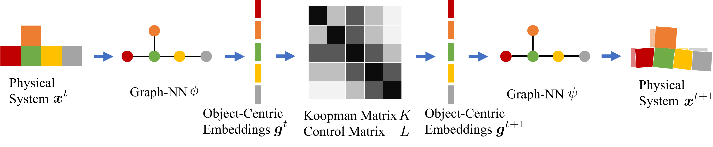

# Learning Compositional Koopman Operators for Model-Based Control

**作者**: Yunzhu Li, Hao He, Jiajun Wu, Dina Katabi, Antonio Torralba  
**会议/期刊**: ICLR 2020  
**arXiv**: [1910.08264](https://arxiv.org/abs/1910.08264)  
**项目页**: [koopman.csail.mit.edu](http://koopman.csail.mit.edu)  
**领域**: 组合式动力学建模、图神经网络、Koopman 表示、模型预测控制  
**关键词**: object-centric embedding、block-wise Koopman、system identification、QP/MPC

{ width="100%" }

<figcaption class="figure-caption">原论文模型图：图网络把物理系统编码成对象中心的 Koopman 嵌入，按对象关系共享的块矩阵 \(K,L\) 推进，再由图解码器还原下一时刻状态。</figcaption>

## 一句话总结

论文用图神经网络把可变数量的物体编码到对象中心的 Koopman 空间，再用按关系类型共享
的块状线性转移矩阵和控制矩阵推进这些嵌入。图编码器保留了对不同对象数和形状的
泛化能力，线性 Koopman 动力学则把系统识别和控制转成低维最小二乘与二次规划问题。

## 研究背景与动机

- **领域现状**：深度物理模拟器能学习复杂交互，但参数多、在线适配慢；传统 Koopman 方法的状态维度和对象数通常固定。
- **现有痛点**：把 \(N\) 个物体拼成一个整体后直接学习 Koopman 矩阵，需要 \(O(N^2)\) 个对象块，无法自然外推到新的对象数。
- **核心矛盾**：需要图网络对对象数量和关系结构的泛化能力，又需要线性动力学带来的快速识别和控制。
- **本文目标**：学习一个组合式的 Koopman 观测函数，让相同物理关系在不同对象对之间复用同一转移块。
- **切入角度**：把物理系统表示为对象-关系图，把整体 Koopman 嵌入拆为对象嵌入，把大矩阵拆为关系条件的小块。
- **核心 idea**：图网络只负责“状态 \(\to\) 对象嵌入”和“嵌入 \(\to\) 状态”，时间推进由共享的块线性算子完成。

## 符号和维度

| 符号 | 维度/取值 | 含义 |
| --- | --- | --- |
| \(N\) | 对象数量 | 当前系统中的物体数，可在训练和测试间变化 |
| \(\mathbf x_i^t\) | 对象 \(i\) 的状态 | 例如位置、速度和对象类型 |
| \(\mathbf g_i^t\) | \(m\) | 对象 \(i\) 的 Koopman 嵌入 |
| \(\mathbf g_t\) | \(Nm\) | 按对象拼接的整体嵌入 |
| \(\mathbf u_i^t\) | \(l\) | 对象 \(i\) 的控制输入 |
| \(\mathbf u_t\) | \(Nl\) | 按对象拼接的整体控制 |
| \(K_{ij}\) | \(m\times m\) | 从对象 \(j\) 到 \(i\) 的 Koopman 转移块 |
| \(L_{ij}\) | \(m\times l\) | 控制 \(u_j^t\) 对对象 \(i\) 嵌入的作用块 |
| \(h\) | 关系类型数 | 共享块的种类数，通常与 \(N\) 无关 |
| \(\widehat K,\widehat L\) | \(h\times m\times m\)、\(h\times m\times l\) | 每种关系对应的共享参数块 |
| \(\phi,\psi\) | 图网络 | 编码器和解码器 |

## 方法详解

### 1. 组合式 Koopman 假设

对没有控制的离散系统，Koopman 观测函数 \(g\) 希望满足

$$
\mathbf g_{t+1}=K\mathbf g_t,\qquad
\mathbf g_t=g(\mathbf x_t).
$$

对有控制的系统，论文使用 Koopman control 形式

$$
\mathbf g_{t+1}=K\mathbf g_t+L\mathbf u_t.
$$

关键假设是整体嵌入按对象拼接：

$$
\mathbf g_t=
\begin{bmatrix}
\mathbf g_1^t\\[-2pt]\vdots\\\mathbf g_N^t
\end{bmatrix}
\in\mathbb R^{Nm},
\qquad
\mathbf g_i^t=g_i(\mathbf x_i^t).
$$

于是 \(K\in\mathbb R^{Nm\times Nm}\) 和
\(L\in\mathbb R^{Nm\times Nl}\) 都可以按对象对分块。若对象对 \((i,j)\) 属于同一
关系类型，则共享同一个 \(m\times m\) 转移块；控制矩阵也采用同样的共享规则。

例如，线性弹簧球系统中，对角块 \(A\) 描述单个球的局部动力学，非对角块 \(B\)
描述球间弹簧作用：

$$
\dot{\mathbf x}=
\begin{bmatrix}
A&B&\cdots&B\\
B&A&\cdots&B\\
\vdots&\vdots&\ddots&\vdots\\
B&B&\cdots&A
\end{bmatrix}\mathbf x.
$$

这个例子说明，块共享不是单纯的参数压缩，而是把“相同物理关系服从相同局部规律”
写成模型归纳偏置。

### 2. 图编码器：得到对象中心 Koopman 嵌入

系统在时刻 \(t\) 表示为有向关系图
\(\mathcal G_t=(\mathcal O_t,\mathcal R)\)。对象节点包含状态和对象类型：

$$
\mathbf o_i^t=(\mathbf x_i^t,\mathbf a_i^o),
$$

关系 \(k\) 由起点 \(u_k\)、终点 \(v_k\) 和关系类型 one-hot 向量
\(\mathbf a_k^r\) 表示。类似 Interaction Network，先计算边效应

$$
\mathbf e_k^t
=f_R(\mathbf o_{u_k}^t,\mathbf o_{v_k}^t,\mathbf a_k^r),
$$

再把所有指向对象 \(i\) 的边效应聚合，并计算对象嵌入

$$
\mathbf g_i^t
=f_O\left(\mathbf o_i^t,
\sum_{k\in\mathcal N_i}\mathbf e_k^t\right),
\qquad
\mathbf g_t=\phi(\mathcal G_t).
$$

其中 \(f_R\) 和 \(f_O\) 是 MLP，\(\mathcal N_i\) 是指向 \(i\) 的关系集合。这个
消息传递阶段允许 \(N\) 改变，因为参数作用在对象和关系类型上，而不是固定长度的
整体状态向量上。

### 3. 共享块如何组成整体 Koopman 矩阵

设共有 \(h\) 种关系，用 one-hot 指示向量
\(\boldsymbol\delta_{ij}\in\{0,1\}^{h}\) 标识对象对 \((i,j)\) 的类型，参数张量为

$$
\widehat K\in\mathbb R^{h\times m\times m},\qquad
\widehat L\in\mathbb R^{h\times m\times l}.
$$

第 \((i,j)\) 个块从对应的共享参数中选出：

$$
K_{ij}=\boldsymbol\delta_{ij}\widehat K,\qquad
L_{ij}=\boldsymbol\delta_{ij}\widehat L.
$$

把所有块拼起来就是

$$
\mathbf g_{t+1}
=
\underbrace{\begin{bmatrix}
K_{11}&\cdots&K_{1N}\\
\vdots&\ddots&\vdots\\
K_{N1}&\cdots&K_{NN}
\end{bmatrix}}_{K}
\mathbf g_t
+
\underbrace{\begin{bmatrix}
L_{11}&\cdots&L_{1N}\\
\vdots&\ddots&\vdots\\
L_{N1}&\cdots&L_{NN}
\end{bmatrix}}_{L}
\mathbf u_t.
$$

无结构矩阵需要 \(N^2m^2\) 个转移参数；共享 \(h\) 个块后只需
\(hm^2\) 个 \(K\) 参数，控制矩阵只需 \(hml\) 个参数。只要 \(h\) 不随 \(N\)
增长，系统识别和模型大小就不会随对象数二次增长。

### 4. 系统识别：把在线适配变成最小二乘

给定 \(T\) 个图状态，先编码

$$
\widetilde{\mathbf g}_{1:T}
=\bigl[\mathbf g_1,\ldots,\mathbf g_T\bigr],
\qquad
\mathbf g_t=\phi(\mathcal G_t).
$$

无控制时，求解

$$
\min_K\left\|K\mathbf g_{1:T-1}-\mathbf g_{2:T}\right\|_F^2,
$$

其最小二乘解为

$$
K=\mathbf g_{2:T}\bigl(\mathbf g_{1:T-1}\bigr)^\dagger.
$$

有控制时，将状态和控制同时回归：

$$
\min_{K,L}
\left\|K\mathbf g_{1:T-1}
+L\mathbf u_{1:T-1}
-\mathbf g_{2:T}\right\|_F^2.
$$

在共享块设定下，不直接优化 \(N^2\) 个块，而是求

$$
\min_{\widehat K,\widehat L}
\left\|
(\boldsymbol\delta\circ\widehat K)\mathbf g_{1:T-1}
+(\boldsymbol\delta\circ\widehat L)\mathbf u_{1:T-1}
-\mathbf g_{2:T}
\right\|_F^2,
$$

其中 \(\boldsymbol\delta\circ\widehat K\) 表示按关系索引展开块矩阵。论文强调这仍是
线性最小二乘问题，因而部署到新对象数量或新物理参数时，只需用少量新轨迹更新
\(\widehat K,\widehat L\)，不必重新训练图网络。

### 5. 解码、训练损失和自由滚动

图解码器 \(\psi\) 将嵌入还原为物理状态：

$$
\widehat{\mathbf x}_t=\psi(\widehat{\mathbf g}_t).
$$

论文联合使用三类损失训练 \(\phi,\psi\)：

**自编码损失**保证当前表示能重建原状态：

$$
\mathcal L_{\mathrm{ae}}
=\frac1T\sum_{t=1}^{T}
\left\|\psi(\phi(\mathbf x_t))-\mathbf x_t\right\|_2.
$$

**预测损失**要求从初始嵌入自由滚动后仍能还原真实轨迹。令

$$
\widehat{\mathbf g}_1=\mathbf g_1,\qquad
\widehat{\mathbf g}_{t+1}
=K\widehat{\mathbf g}_t+L\mathbf u_t,
$$

则

$$
\mathcal L_{\mathrm{pred}}
=\frac1T\sum_{t=1}^{T}
\left\|\psi(\widehat{\mathbf g}_t)-\mathbf x_t\right\|_2.
$$

**度量损失**要求 Koopman 空间保留原状态空间的距离：

$$
\mathcal L_{\mathrm{metric}}
=\sum_{i,j}
\left|
\|\mathbf g_i-\mathbf g_j\|_2
-\|\mathbf x_i-\mathbf x_j\|_2
\right|.
$$

最终目标为

$$
\mathcal L
=\mathcal L_{\mathrm{ae}}
+\lambda_1\mathcal L_{\mathrm{pred}}
+\lambda_2\mathcal L_{\mathrm{metric}}.
$$

度量损失对控制尤其重要：如果嵌入距离不能反映物理状态距离，在嵌入空间中到达
\(\mathbf g^\star\) 并不等于在真实空间中到达目标 \(\mathbf x^\star\)。

### 6. 控制：线性系统上的 QP 和 MPC

给定目标状态 \(\mathbf x^\star\)，先编码为
\(\mathbf g^\star=\phi(\mathbf x^\star)\)。论文将控制代价写在 Koopman 空间：

$$
c_t(\mathbf g_t,\mathbf u_t)
=\mathbf 1[t=T]\|\mathbf g_t-\mathbf g^\star\|_2^2
+\lambda\|\mathbf u_t\|_2^2.
$$

在约束

$$
\mathbf g_{t+1}=K\mathbf g_t+L\mathbf u_t,
\qquad
\mathbf g_1=\phi(\mathbf x_1)
$$

下，对 \(\{\mathbf g_t,\mathbf u_t\}_{t=1}^{T}\) 最小化总代价就是二次规划。
因为动力学约束是线性的、代价是二次的，求解速度比在原始非线性模型上反复优化更快。

长时间控制使用 MPC：先求出一段控制，执行 \(\tau\) 步后从环境获得反馈，
重新编码当前状态并再次求解 QP。这样用线性模型的效率换取周期性反馈纠错。

### 7. 完整算法流程

~~~text
训练阶段：
    1. 将每个时刻的多对象状态构造成对象-关系图 G_t。
    2. 用图编码器 phi 计算每个对象的嵌入 g_i^t，并拼成 g_t。
    3. 根据对象对的关系类型，将 K_ij、L_ij 绑定到共享块 K_hat、L_hat。
    4. 用历史转移对 (g_t, u_t, g_{t+1}) 解块结构最小二乘，得到 K、L。
    5. 用 K、L 自由滚动，经过图解码器 psi 得到预测状态。
    6. 联合优化重建损失、自由滚动预测损失和距离保持损失。

新环境适配：
    冻结 phi、psi；收集少量新环境轨迹；重新用块结构最小二乘更新 K_hat、L_hat。

控制：
    编码当前状态和目标状态；在 g_{t+1}=K g_t+L u_t 下求解 QP；
    执行一段控制；按 MPC 周期获得反馈并重复。
~~~

## 实验与实证观察

论文在 Rope、Soft、Swim 三种可变对象数环境中测试预测和控制。训练系统含
5--9 个对象，额外测试含 10--14 个对象，用于检验对象数外推。训练时每个对象的
Koopman 嵌入维度主设为 \(m=32\)，使用 Adam、学习率 \(10^{-4}\)，并在测试环境
用少量轨迹重新识别转移矩阵。

Rope 环境中不同矩阵结构的结果如下，括号内是对象数外推到 10--14 个时的误差：

| 结构 | 100 步模拟 MSE | 40 步控制误差 |
| --- | --- | --- |
| Diag：只有共享对角块 | \(0.133\;(0.174)\) | \(2.337\;(2.809)\) |
| None：每个对象对独立 | \(0.117\;(0.083)\) | \(1.522\;(1.288)\) |
| Block：按关系共享块 | **\(0.105\;(0.075)\)** | **\(0.854\;(1.101)\)** |

论文报告的主要现象是：Block 结构在模拟和控制上都更好；Diag 过度简化交互，
None 虽有相近的模拟误差，却更容易过拟合，得到的矩阵不利于控制。模型可在超过
100 步的滚动中保持较小误差，并优于 Interaction Networks、Propagation Networks
以及手工多项式 Koopman 基函数。

## 对异质图联邦学习的可借鉴思路

**第一，把客户端图看成组合系统。** 节点类型、边类型和局部交互可以对应
\(\mathbf o_i\)、\(\mathbf a_i^r\) 与共享块。比起直接平均完整 \(N\times N\) 算子，
更自然的是在关系类型或功能类型上共享小块参数。

**第二，用关系条件块替代未对齐的全局算子平均。** 客户端 \(m\) 可以学习
\(\widehat K_m^{(r)}\)，再在公共关系标签、probe 响应或 transport 坐标中比较。
只有关系语义一致时，才考虑聚合块；不同图中的节点编号不应成为参数对齐依据。

**第三，在线适配适合低维充分统计量。** 在固定图编码器后，客户端可以只上传
\(\mathbf g_{t+1}\mathbf g_t^\top\)、\(\mathbf g_t\mathbf g_t^\top\) 等受保护统计量，
或直接在本地完成块最小二乘并只交换经过验证的功能响应。这样可以把联邦更新集中在
小型动力学参数，而不是反复上传完整 GNN。

**第四，控制场景需要保留距离结构。** 若未来联邦代理要支持规划或控制，除了预测
误差，还需验证 latent distance 是否对应任务空间距离；这正是论文
\(\mathcal L_{\mathrm{metric}}\) 可迁移到图动力学代理的原因。

## 局限与使用边界

- 块共享依赖关系类型正确；如果不同关系实际对应不同物理规律，强行共享会产生系统误差。
- 线性 Koopman 推进只在学习到的观测空间和数据覆盖范围内近似有效，不能自动保证长期稳定。
- 度量损失只约束样本间距离，不等于整个状态空间上的严格等距映射。
- 论文的控制实验使用仿真系统和短期适配轨迹；真实系统还会受到观测噪声、执行器约束和模型失配影响。
- 对异质图联邦学习而言，关系类型、节点置换和潜坐标对齐仍需显式设计，不能直接把各客户端的 \(K_m\) 做逐元素 FedAvg。
