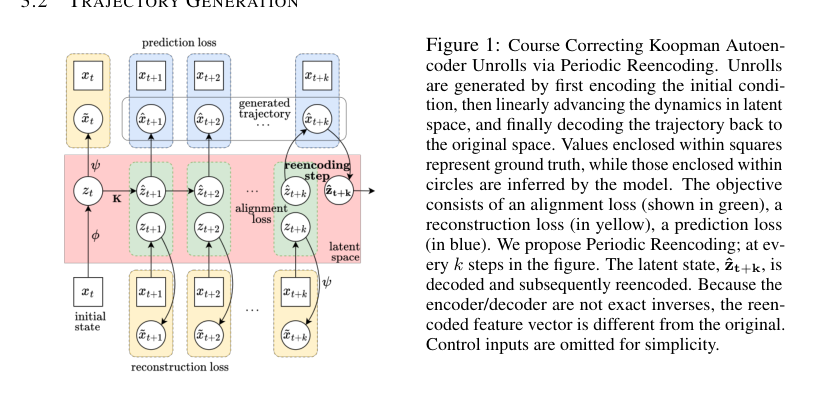

# Course Correcting Koopman Representations

**作者**: Mahan Fathi, Clement Gehring, Jonathan Pilault, David Kanaa, Pierre-Luc Bacon, Ross Goroshin  
**会议/期刊**: 未发表预印本  
**arXiv**: [2310.15386](https://arxiv.org/abs/2310.15386)  
**代码**: 当前阅读材料未确认公开代码  
**领域**: Koopman 自编码器、长程动力学预测、潜态纠偏  
**关键词**: periodic reencoding, latent drift, long-horizon prediction, Koopman dynamics

{ width="100%" }

<figcaption class="figure-caption">原论文 Figure 1 的框架截取：真实状态用于训练监督，预测链在潜空间推进，并在指定间隔将解码预测重新编码。</figcaption>

## 一句话总结

论文指出，潜空间中看似线性的自由滚动可能在长时域发生漂移，因此提出只依赖
模型自身解码结果的周期重编码，把预测潜态周期性地送回编码器后再继续推进。

## 研究背景与动机

- **领域现状**：Koopman autoencoder 试图把非线性状态映射到线性潜空间，再用矩阵指数或离散矩阵进行多步预测。
- **现有痛点**：短期潜态拟合好不代表长程轨迹有效；编码器和解码器不是严格互逆时，滚动误差会改变后续潜态。
- **核心矛盾**：固定线性推进追求高效和可复合，解码器的非线性与表示误差却会让预测逐渐离开编码器支持区域。
- **本文目标**：分析潜态自由滚动的结构性失败；设计低额外观测要求的长程纠偏机制。
- **切入角度**：把解码器输出重新看作一个可被编码器校正的状态，而不是永远相信潜空间轨迹。
- **核心 idea**：每隔若干步执行 \(z\leftarrow E(D(z))\)，用模型自己的状态观测修正潜态漂移。

## 方法详解

### 整体框架

受控系统的连续潜动力学写为

$$
\dot z=K_cz+L_c\upsilon,\qquad \upsilon=E_u(u).
$$

论文采用双线性离散化，将连续参数和步长 \(\delta\) 转为离散推进：

$$
K=\left(I-\frac{\delta}{2}K_c\right)^{-1}
\left(I+\frac{\delta}{2}K_c\right),qquad
L=\left(I-\frac{\delta}{2}K_c\right)^{-1}\delta L_c,
$$

$$
\widehat z_{t+1}=K\widehat z_t+L\upsilon_t,qquad
\widehat x_{t+1}=D(\widehat z_{t+1}).
$$

无控制的图传播代理可以去掉 \(L\upsilon_t\)，只保留固定 \(K\) 的迭代。

### 关键设计

**1. 训练时同时约束真实编码和预测编码**

- **功能**：让自由滚动的潜态不只在矩阵回归意义下接近真实，而是能解码回真实状态。
- **核心思路**：从 \(x_t\) 编码得到起点 \(z_t\)，只用 \(K,L\) 推进预测链；真实未来状态另行编码用于对齐监督。
- **设计动机**：如果每一步直接把真实状态编码后再推进，训练会变成 teacher forcing，无法暴露长程潜态漂移。

三类损失可以写成：

$$
\mathcal L_{\mathrm{align}}=\sum_{s=1}^{T}
\|\widehat z_{t+s}-E(x_{t+s})\|_2^2,
$$

$$
\mathcal L_{\mathrm{rec}}=\sum_{s=0}^{T}
\|x_{t+s}-D(E(x_{t+s}))\|_2^2,qquad
\mathcal L_{\mathrm{pred}}=\sum_{s=1}^{T}
\|x_{t+s}-D(\widehat z_{t+s})\|_2^2.
$$

**2. 周期重编码是推理机制，不是免费稳定性证明**

令 \(k\) 为重编码周期，先按潜算子推进并解码；在每个周期点把预测状态重新编码：

$$
\bar z_{t+1}=K\widehat z_t+L E_u(u_t),\qquad
\widehat x_{t+1}=D(\bar z_{t+1}),
$$

$$
\widehat z_{t+1}=\begin{cases}
E(\widehat x_{t+1}),&(t+1)\bmod k=0,\\
\bar z_{t+1},&\text{otherwise}.
\end{cases}
$$

这里重新编码的是模型自己生成的 \(\widehat x\)，不是额外读取的真实未来状态。
若每一步读取真实状态，任务就变成了带观测校正的状态估计，不再是相同预测问题。

**3. 纠偏改变了最终预测器的结构**

周期重编码实际引入复合映射 \(E\circ D\)。它可能把潜态拉回有效区域，也可能积累
新的编解码误差；当 \(k\) 很小，计算成本和非线性反馈都会增加。因此使用周期重编码
后得到的是“线性推进 + 非线性纠偏”的复合系统，不应把它的效果全部归因于固定
\(K^s\) 自由滚动。

### 训练与推理伪代码

```text
训练：
    取窗口 x[t:t+T] 和可选控制 u[t:t+T-1]
    z = E(x[t])
    对 s = 1,...,T：
        z = K @ z + L @ E_u(u[t+s-1])
        x_pred[s] = D(z)
    另编码真实 x[t:t+T]
    优化 latent alignment、reconstruction 和 prediction 损失

推理（周期 k）：
    z = E(x[0])
    对 s = 1,...,H：
        z_bar = K @ z + L @ E_u(u[s-1])
        x_hat[s] = D(z_bar)
        若 s % k == 0：
            z = E(x_hat[s])
        否则：
            z = z_bar
```

## 对异质图联邦学习的可借鉴思路

**第一，把周期重编码当作表示瓶颈诊断。** 对每个客户端图，比较不重编码、每步
重编码和若干周期重编码的任务响应。如果只有重编码版本可用，说明客户端的潜态
线性闭合可能不足；这时不能直接把该模型输出当作可运输的线性动力学知识。

**第二，纠偏应发生在本地有效图状态流形上。** 客户端使用自己的图编码器和解码器
执行 \(E_m(D_m(z))\)，服务器不需要获取节点状态。若后续建立公共功能坐标，可先把
客户端的预测状态映射到公共 probe 响应，再比较不同 \(k_m\) 下的误差和计算成本。
这比给所有客户端设一个统一门控阈值更符合异质动力学：不同图的漂移速度和解码误差
可能不同。

**第三，门控依据应是动力学量。** 未来可以让本地门控使用潜态漂移、自由滚动响应
残差或 \(\|E_m(D_m(z))-z\|\) 的验证集统计，而不是根据客户端 ID 或模型参数范数
手工切换。但门控策略必须与不重编码基线并列报告，避免把额外纠偏操作隐藏在主模型中。

## 局限与使用边界

- 周期重编码不能证明固定 \(K\) 本身已经在潜空间闭合；它是纠偏后的复合预测流程。
- 重新编码不一定是投影，也不保证稳定；周期太短会增加编解码成本和误差累积。
- 如果客户端没有统一的编码坐标，直接交换重编码后的潜向量仍可能没有语义。
- 图场景需要额外保证节点置换一致性，并核算图编码、节点解码和本地缓存成本。
