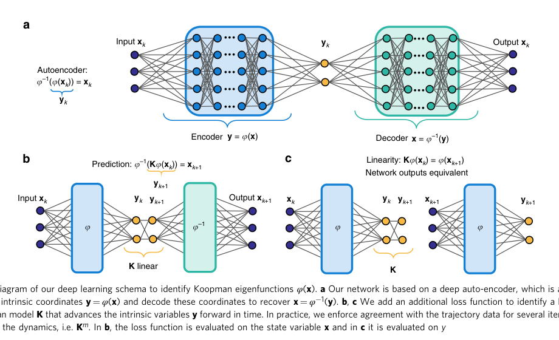

# Deep learning for universal linear embeddings of nonlinear dynamics

**作者**: Bethany Lusch, J. Nathan Kutz, Steven L. Brunton  
**会议/期刊**: Nature Communications, 2018  
**arXiv**: [1712.09707](https://arxiv.org/abs/1712.09707)  
**代码**: [BethanyL/DeepKoopman](https://github.com/BethanyL/DeepKoopman)  
**领域**: 非线性动力学表示学习、Koopman embedding  
**关键词**: Koopman eigenfunctions, autoencoder, nonlinear dynamics, latent linearity

{ width="100%" }

<figcaption class="figure-caption">原论文 Figure 1 的框架截取：编码器寻找内在坐标，潜空间线性算子负责推进，解码器回到原状态空间。</figcaption>

## 一句话总结

论文的核心不是把一个已经选好的状态基底交给线性回归，而是让编码器、线性动力学
和解码器共同学习，使强非线性系统在数据覆盖的区域内呈现近似线性演化。

## 研究背景与动机

- **领域现状**：非线性系统通常直接拟合向量场，或使用 DMD、手工字典等方法寻找线性表示。
- **现有痛点**：Koopman 特征函数可能数量很多、难以计算；直接使用原始状态做线性演化通常表达能力不足。
- **核心矛盾**：坐标变换必须同时保留状态信息，又要让时间演化变得简单，单独优化重建或单步预测都不够。
- **本文目标**：学习低维、可解释的 Koopman 坐标；在该坐标中进行预测和后续分析。
- **切入角度**：把自编码器的瓶颈从“压缩图像特征”改造成“寻找动力学内在坐标”。
- **核心 idea**：让一个坐标同时满足“能解码回状态”和“经过同一个线性算子后仍对应真实未来”。

## 方法详解

### 整体框架

给定离散动力系统

$$
x_{k+1}=F(x_k),
$$

模型由编码器 \(\phi\)、潜空间演化模块 \(K\) 和解码器 \(\phi^{-1}\) 组成：

$$
y_k=\phi(x_k),\qquad \widehat y_{k+s}=K^s y_k,qquad
\widehat x_{k+s}=\phi^{-1}(\widehat y_{k+s}).
$$

训练数据来自多个初始条件的完整轨迹。真实未来状态可以用于监督，但自由滚动的
预测链只从起点潜态开始，不能每一步重新读取真实未来状态。

### 关键设计

**1. 深度自编码器学习潜坐标**

- **功能**：将原状态 \(x\in\mathbb R^n\) 映射到低维坐标 \(y\in\mathbb R^r\)，并尽可能恢复原状态。
- **核心思路**：编码器与解码器是非线性网络，瓶颈坐标由动力学损失共同塑造，而不是先做 PCA/SVD 再固定基底。
- **设计动机**：非线性系统的有用坐标未必是原状态的高方差方向；学习坐标可以直接服务于可预测性和可解释的线性演化。

**2. 三条训练路径共同约束动力学**

重建、解码预测和潜态一致性分别对应不同约束：

$$
\mathcal L_{\mathrm{rec}}=\operatorname{MSE}(\phi^{-1}(\phi(x_0)),x_0),
$$

$$
\mathcal L_{\mathrm{pred}}=\frac1{S_p}\sum_{s=1}^{S_p}
\operatorname{MSE}(\phi^{-1}(K^s\phi(x_0)),x_s),
$$

$$
\mathcal L_{\mathrm{lin}}=\frac1T\sum_{s=1}^{T}
\operatorname{MSE}(K^s\phi(x_0),\phi(x_s)).
$$

重建只检查表示容量，潜态一致性检查近似闭合，解码后的多步预测才检查该闭合
是否对应原空间中的真实轨迹。论文还加入最大误差和权重正则项，以避免平均 MSE
掩盖局部失败。

**3. 固定线性与状态条件演化是两个不同设定**

在固定谱的系统中，一个固定 \(K\) 可以反复复合。对频率或增长率依赖状态的
连续谱系统，论文用辅助网络从潜态产生局部参数，再构造旋转-缩放块，例如：

$$
(\mu_t,\omega_t)=\Lambda_\eta(y_t),\qquad
B_t=e^{\mu_t\Delta t}
\begin{bmatrix}
\cos(\omega_t\Delta t)&-\sin(\omega_t\Delta t)\\
\sin(\omega_t\Delta t)&\cos(\omega_t\Delta t)
\end{bmatrix},
\qquad y_{t+1}=B_t y_t.
$$

此时每一步的矩阵依赖当前预测潜态，不能把整段演化误称为固定 \(K^s\)。

### 训练与推理伪代码

```text
输入：多条训练轨迹 x[0:T]
初始化：编码器 phi、解码器 psi、潜空间动力学 K

重复直到收敛：
    采样初始时刻和连续窗口 x[0:L]
    y0 = phi(x[0])
    x_recon = psi(y0)
    y_pred = y0
    对 s = 1,...,L：
        y_pred = K @ y_pred
        x_pred[s] = psi(y_pred)
    对真实未来态编码：y_true[s] = phi(x[s])
    计算重建损失、潜态一致性损失和自由滚动预测损失
    反向传播并更新 phi、psi、K

推理：只编码一次初始状态，反复应用 K，再由 psi 解码目标时刻。
```

## 对异质图联邦学习的可借鉴思路

**第一，传递对象应从参数改成动力学响应。** 对客户端图系统
\(H_{t+1}^m=\Phi_m(H_t^m)\)，可用图编码器得到 \(z_t^m=E_m(H_t^m,G_m)\)，
再用 \(K_m\) 预测未来。不同客户端即使学到相同的物理作用，也可能存在潜坐标
变换 \(z'_m=S_mz_m\)，此时 \(K'_m=S_mK_mS_m^{-1}\)。因此不能直接对 \(K_m\)
做逐元素 FedAvg。

**第二，用公共 probe 建立可比较的功能坐标。** 服务器可以发布不含私有样本的
初始状态 probe、扰动方向或统计性图信号；客户端返回冻结读出下的有限时间响应

$$
\mathcal R_m(Q)=\left[\mathcal O_m\!\left(D_m(K_m^sE_m(Q))\right)\right]_{s\in\mathcal H}.
$$

后续比较或知识流动应优先发生在 \(\mathcal R_m(Q)\) 或显式 transport 后的功能
坐标中，而不是发生在未经对齐的编码器权重和算子矩阵中。

**第三，把多步自由滚动作为异质性判据。** 若两个客户端对同一公共 probe 的
短期响应相近、长程响应明显分叉，差异反映的是动力学作用而不只是静态参数差异。
这为后续定义“可迁移知识”和“有害异质性”提供了观测空间，也与本项目的冻结
主干、冻结读出和有限时间代理设定一致。

## 局限与使用边界

- Koopman 理论不保证任意非线性系统都存在足够低维、固定且可重建的 \(K\)。
- 论文中的低维物理例子不能直接证明整图节点状态也能压缩到同样维度。
- 状态条件算子增强表达能力，但它改变了“一个固定矩阵自由滚动”的研究问题。
- 本项目使用图消息传递替换全连接状态网络；不对大图拉普拉斯或节点特征矩阵做 SVD。
