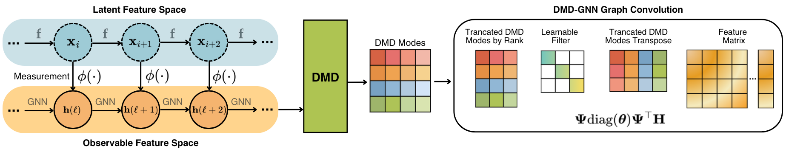

# When Graph Neural Networks Meet Dynamic Mode Decomposition

**作者**: Dai Shi, Lequan Lin, Andi Han, Zhiyong Wang, Yi Guo, Junbin Gao  
**会议/期刊**: arXiv 预印本，v1，2024-10-08（论文标注为 under review）  
**arXiv**: [2410.05593](https://arxiv.org/abs/2410.05593)  
**代码**: 当前论文页面未给出公开代码链接  
**领域**: 图神经网络动力学、Koopman 算子、Dynamic Mode Decomposition  
**关键词**: DMD-GNN、低秩谱滤波、图扩散、长程交互、物理约束

{ width="100%" }

<figcaption class="figure-caption">原论文 Figure 1 的流程截取：初始图动力学产生连续特征状态，DMD 从状态对中提取低秩模态，再用截断模态和可学习谱滤波器传播节点特征。</figcaption>

## 一句话总结

论文把 GNN 的层间传播写成离散动力系统，把初始 GNN 产生的两个特征状态
作为快照，用 DMD 在节点空间估计一个低秩的线性传播算子；其特征向量（DMD
模态）随后被用作谱滤波基底。这样得到的 DMD-GNN 可以用少量可学习滤波参数
近似原始 GNN 动力学，同时让低秩算子呈现稠密的跨节点作用，从而缓解长程图中的
over-squashing。

## 研究背景与动机

- **领域现状**：空间消息传递通常使用邻接矩阵聚合，谱方法则在拉普拉斯或其特征向量上滤波；大量工作已经把 GNN 解释为扩散或反应-扩散过程。
- **现有痛点**：普通 GNN 往往只根据当前层状态做局部传播，很少使用多个状态之间的动力学关系；层数增加还会带来 over-smoothing 和 over-squashing。
- **核心矛盾**：需要保留图结构和物理传播的归纳偏置，又希望得到能够跨较远节点传播、参数量可控的算子。
- **本文目标**：用数据驱动的 DMD 估计初始 GNN 动力学的主导谱子空间，并将其转成可训练的图卷积。
- **切入角度**：把 GNN 层索引 \(\ell\) 当作离散时间，把节点特征矩阵 \(\mathbf H(\ell)\) 当作动力系统状态，把多列特征快照交给 DMD 做低秩拟合。
- **核心 idea**：初始动力学负责提供“数据和物理先验”，DMD 负责提取模态，最终 GNN 只在这些模态上学习一个对角滤波器。

## 符号和维度

| 符号 | 维度/取值 | 含义 |
| --- | --- | --- |
| \(\mathcal G=(\mathcal V,\mathcal E)\) | \(N\) 个节点 | 可加权、可有向的图 |
| \(\mathbf X\) | \(N\times d_{\mathrm{in}}\) | 原始节点特征 |
| \(\mathbf H(\ell)\) | \(N\times d_\ell\) | 第 \(\ell\) 层节点特征，行对应节点 |
| \(\mathbf A,\mathbf L\) | \(N\times N\) | 邻接矩阵和图拉普拉斯 |
| \(\widehat{\mathbf A}\) | \(N\times N\) | 实验中使用的归一化邻接矩阵 |
| \(\mathbf H_0,\mathbf H_1\) | \(N\times d\) | DMD 输入快照，分别等于 \(\mathbf H(\ell)\)、\(\mathbf H(\ell+1)\) |
| \(r\) | \(r\leq\min(N,d)\) | 截断后的有效秩 |
| \(\widetilde{\mathbf K}\) | \(r\times r\) | DMD 的约化算子 |
| \(\boldsymbol\Psi\) | \(N\times r\) | 回到节点空间的 DMD 模态矩阵 |
| \(\boldsymbol\theta\) | \(r\) | DMD-GNN 学习的模态滤波系数 |
| \(\mathbf W(\ell)\) | \(d_\ell\times d_{\ell+1}\) | 特征通道变换矩阵 |

论文在不同段落中都用 \(\mathbf K\) 表示算子：一处指 \(r\times r\) 的约化算子，
另一处又指 \(N\times N\) 的节点传播算子。下面使用
\(\widetilde{\mathbf K}\) 表示约化算子，使用 \(\widehat{\mathbf F}_{\mathrm{DMD}}\) 或
\(\mathbf P_{\boldsymbol\theta}\) 表示提升到节点空间的传播，避免混淆。

## 方法详解

### 1. 先把 GNN 写成图上的动力系统

一般的空间或谱 GNN 都可以写成

$$
\mathbf H(\ell+1)=\mathcal F(\mathbf H(\ell)).
$$

如果 \(\mathcal F(\mathbf H)=\mathbf A\mathbf H\)，它是邻居聚合；如果
\(\mathcal F(\mathbf H)=\mathbf U\operatorname{diag}(\boldsymbol\theta)\mathbf U^\top\mathbf H\)，
它是谱滤波。论文进一步从连续扩散出发：节点 \(i\) 的信号
\(\mathbf h_i(t)\in\mathbb R^d\) 满足

$$
\frac{\partial \mathbf h_i(t)}{\partial t}
=\sum_{j:(i,j)\in\mathcal E}
\mathcal S_{ij}(\mathbf h_i(t),\mathbf h_j(t),t)
\bigl(\mathbf h_j(t)-\mathbf h_i(t)\bigr).
$$

最简单的常系数情形是

$$
\frac{\partial \mathbf H}{\partial t}=-\mathbf L\mathbf H,
\qquad
\mathbf H(t)=\exp(-t\mathbf L)\mathbf H(0),
$$

它会让节点表示逐渐同质化，形成 over-smoothing。加入只作用于节点的反应项
\(\mathcal R\) 后，论文使用更一般的反应-扩散形式

$$
\frac{\partial \mathbf h_i(t)}{\partial t}
=\alpha\sum_{j:(i,j)\in\mathcal E}\mathcal S_{ij}(\cdot)
\bigl(\mathbf h_j(t)-\mathbf h_i(t)\bigr)
+\beta\mathcal R(\mathbf h_i(t),t).
$$

用 \(\mathbf H(0)=\mathrm{MLP}_{\mathrm{in}}(\mathbf X)\) 和
\(\mathbf Y=\mathrm{MLP}_{\mathrm{out}}(\mathbf H(T))\) 实现时，
\(\mathcal P(\mathbf H)=-\alpha\mathbf L\mathbf H+\beta\mathcal R(\mathbf H,t)\)。
Euler 离散化得到

$$
\mathbf H(\ell+1)=\mathbf A\mathbf H(\ell)+\mathcal R(\mathbf H(\ell),\ell),
$$

这说明即使初始动力学是非线性的，也可以把它当作 DMD 的快照生成器。

### 2. DMD 的实际计算：从两个快照到低秩模态

设 \(\mathbf H_0=\mathbf H(\ell)\in\mathbb R^{N\times d}\)，
\(\mathbf H_1=\mathbf H(\ell+1)\in\mathbb R^{N\times d}\)。论文假设存在一个左作用

$$
\mathbf H_1\approx\mathcal F\mathbf H_0,
\qquad \mathcal F\in\mathbb R^{N\times N}.
$$

#### 第一步：最小二乘传播算子

不加秩约束时，最小二乘解为

$$
\mathcal F^\star
=\arg\min_{\mathcal F}\|\mathbf H_1-\mathcal F\mathbf H_0\|_F^2
=\mathbf H_1\mathbf H_0^\dagger.
$$

直接求 \(N\times N\) 的 \(\mathcal F^\star\) 代价很高，所以只在
\(\mathbf H_0\) 的列空间中估计它。

#### 第二步：对当前快照做截断 SVD

写薄 SVD 为

$$
\mathbf H_0=\mathbf U_r\boldsymbol\Sigma_r\mathbf V_r^*,
$$

其中 \(\mathbf U_r\in\mathbb R^{N\times r}\)、
\(\boldsymbol\Sigma_r\in\mathbb R^{r\times r}\)、
\(\mathbf V_r\in\mathbb R^{d\times r}\)，\(^*\) 表示转置或复共轭转置。
保留的 \(r\) 由谱能量阈值 \(\xi\) 决定：

$$
r=\min\left\{q:\frac{\sum_{i=1}^{q}\sigma_i^2}
{\sum_i\sigma_i^2}\geq\xi\right\},
$$

其中 \(\sigma_i\) 是奇异值。论文经验上使用 \(\xi\in[0.7,0.9]\)：
\(\xi\) 越大，保留的模态越多；\(\xi\) 越小，主要保留慢衰减/低频模态。

#### 第三步：约化到 \(r\times r\)

将 \(\mathcal F^\star\) 投影到 \(\operatorname{col}(\mathbf U_r)\)，得到

$$
\begin{aligned}
\widetilde{\mathbf K}
&=\mathbf U_r^*\mathcal F^\star\mathbf U_r\\
&=\mathbf U_r^*\mathbf H_1\mathbf V_r\boldsymbol\Sigma_r^{-1}.
\end{aligned}
$$

这一步是算法的关键：需要分解的是 \(r\times r\) 矩阵，而不是 \(N\times N\) 矩阵。
若保留全部有效秩，则其对应的提升算子可以写成

$$
\widehat{\mathcal F}_{\mathrm{DMD}}
=\mathbf H_1\mathbf V_r\boldsymbol\Sigma_r^{-1}
\mathbf U_r^*,
$$

它的秩不超过 \(r\)，并且在 \(\mathbf H_0\) 的列空间上复现最小二乘传播。

#### 第四步：特征分解和 DMD 模态

令

$$
\widetilde{\mathbf K}\mathbf Q=\mathbf Q\boldsymbol\Lambda,
$$

其中 \(\mathbf Q\in\mathbb C^{r\times r}\) 为约化算子的特征向量，
\(\boldsymbol\Lambda\) 为特征值对角矩阵。投影 DMD 模态为

$$
\boldsymbol\Psi=\mathbf U_r\mathbf Q
=\mathbf H_0\mathbf V_r\boldsymbol\Sigma_r^{-1}\mathbf Q
\in\mathbb C^{N\times r}.
$$

论文还给出 exact DMD 模态

$$
\boldsymbol\Psi_{\mathrm{exact}}
=\mathbf H_1\mathbf V_r\boldsymbol\Sigma_r^{-1}\mathbf Q.
$$

当 \(\mathbf H_1\) 的列空间包含在 \(\mathbf H_0\) 的列空间中时，两种模态一致。
直观上，\(\boldsymbol\Psi\) 的每一列是一个跨节点的空间模式，
\(\boldsymbol\Lambda\) 描述该模式一步传播时的增长、衰减或振荡。

### 3. DMD-GNN 的谱滤波层

DMD-GNN 不直接把原始 \(\mathbf A\) 当作传播矩阵，而是使用 DMD 模态构造

$$
\mathbf P_{\boldsymbol\theta}
=\boldsymbol\Psi\operatorname{diag}(\boldsymbol\theta)\boldsymbol\Psi^*,
$$

并进行特征传播

$$
\mathbf H(\ell+1)
=\boldsymbol\Psi\operatorname{diag}(\boldsymbol\theta)
\boldsymbol\Psi^*\mathbf H(\ell)\mathbf W(\ell).
$$

原文在实值实现中写作 \(\boldsymbol\Psi^\top\)。这里使用 \(^*\) 表示更一般的
共轭转置；若 DMD 模态是非正交复基，严格实现还应使用相应的双基/重构规则。

- \(\boldsymbol\Psi\) 从初始动力学的数据中得到，通常不是端到端学习的自由参数。
- \(\boldsymbol\theta\in\mathbb R^r\) 是真正的可学习谱滤波系数；它可以抑制或放大不同 DMD 模态。
- \(\mathbf W(\ell)\) 负责通道变换，左侧的 \(\mathbf P_{\boldsymbol\theta}\) 负责节点维传播。
- 若令 \(\boldsymbol\theta\) 接近特征值向量 \(\operatorname{diag}(\boldsymbol\Lambda)\)，该层接近 DMD 对初始动力学的推进；训练时则允许任务损失重新调整滤波强度。

虽然 \(\mathbf P_{\boldsymbol\theta}\) 在节点空间通常是稠密的，但其秩最多为 \(r\)。
计算时可以先做 \(\boldsymbol\Psi^*\mathbf H\)，再做 \(\boldsymbol\Psi(\cdot)\)，
避免显式形成 \(N\times N\) 矩阵，传播复杂度约为 \(O(Nrd)\)（不含求 DMD 的成本）。
这也是它能把远距离节点直接联系起来的原因；但 \(\boldsymbol\Psi\) 本身仍需存储，
因此不能把“低秩”简单等同于所有场景下都比稀疏消息传递更省。

### 4. 初始动力学如何决定 DMD-GNN 的行为

论文用同一套 DMD 过程包裹不同的初始动力学，形成一族模型：

**DMD-GCN**：

$$
\mathbf H_1=\widehat{\mathbf A}\mathbf H_0.
$$

**DMD-SGC**：

$$
\mathbf H_1=\widehat{\mathbf A}^{\,s}\mathbf H_0,
\qquad s=2\text{（实验设定）}.
$$

**DMD++**：

$$
\mathbf H_1=\alpha\widehat{\mathbf A}^{\,2}\mathbf H_0
+(1-\alpha)\mathbf H_0.
$$

**DMD-ACMP**：以反应-扩散模型产生快照，离散形式为

$$
\mathbf H_1=(\mathbf A-\mathbf B)\mathbf H_0
+\mathbf H_0\odot\bigl(\mathbf 1-\mathbf H_0\odot\mathbf H_0\bigr),
$$

其中 \(\odot\) 是逐元素乘法，\(\mathbf B\) 控制扩散方向，\(\mathbf 1\) 与
\(\mathbf H_0\) 同形状。随后 DMD 将这个非线性一步映射压缩成主导的线性模态。

这个选择不是无关紧要的预处理：\(\widehat{\mathbf A}\) 的特征值在 \([-1,1]\)，
\(\widehat{\mathbf A}^{\,2}\) 的特征值落在 \([0,1]\)，因此更偏向平滑，适合
同质图；加入源项可以保留正负谱成分，对异质图的锐化和混合传播更友好。

### 5. 从输入到预测的完整流程

~~~text
输入：图 G=(V,E)、节点特征 X、初始动力学 F0、截断能量 xi

1. 生成快照：H0 = Phi(X) 或 MLP_in(X)，H1 = F0(H0)
2. 截断 SVD：H0 = U_r Sigma_r V_r^*，按 xi 选择 r
3. 约化 DMD：K_tilde = U_r^* H1 V_r Sigma_r^{-1}
4. 模态分解：K_tilde Q = Q Lambda，Psi = U_r Q
5. 构造 DMD 滤波器：P_theta = Psi diag(theta) Psi^*
6. GNN 传播：H_next = P_theta H W；按任务需要堆叠层或接 MLP_out
7. 用节点分类、回归或链路预测损失训练 theta、W 和任务头

推理：固定当前图上的 Psi，输入新的节点特征，执行低秩模态传播并解码任务输出。
时空图预测时，将历史/当前图状态作为快照，DMD 学到的是随数据变化的有效谱空间。
~~~

### 6. 理论结论：DMD 为什么能抓住主导动力学

论文考虑连续系统在原点有稳定固定点，并写成

$$
\dot{\mathbf x}=\mathcal A\mathbf x+\widetilde{\mathbf f}(\mathbf x),
\qquad \widetilde{\mathbf f}(\mathbf x)=o(\lVert\mathbf x\rVert),
$$

其中 \(\mathcal A=D\mathbf f(0)\) 为线性化矩阵。假设 \(\mathcal A\) 对称，
特征值可分成慢衰减子空间 \(S\) 和快衰减子空间 \(F\)，且数据在 \(F\) 上的分量
比 \(S\) 上的分量高阶更小。论文的非正式结论是：DMD 输出 \(\mathcal D\) 具有

$$
\mathcal D
=\mathbf U(\mathcal A)_S
\exp(\boldsymbol\Lambda_S\Delta t)
\mathbf U(\mathcal A)_S^\top
+O\!\left(\lVert\mathbf U(\mathcal A)_S\mathbf X\rVert^\tau\right),
$$

并且在该误差阶下，与切于原点的慢衰减谱子流形上的线性化动力学局部拓扑共轭。
它支持这样的解释：当快模态已经迅速衰减、数据秩足够且采样落在该局部区域时，
DMD 会优先提取真正驱动长期变化的慢谱成分。

这不是任意图、任意输入范围上的全局保证。论文的条件包括固定点、光滑性、对称
线性化以及慢/快谱分离；在训练图外或非稳定动力学中，截断模态仍需通过任务响应验证。

## 实验与实证观察

论文评估节点分类、长程图、时空图预测和链路预测，并比较 DMD-GCN、DMD-SGC、
DMD++、DMD-ACMP 等变体。代表性结果如下（均为论文报告的均值）：

| 任务 | DMD 代表结果 | 论文中的观察 |
| --- | --- | --- |
| 同质图 Cora | DMD-SGC \(84.1\pm0.4\) | 高于 GCN 的 \(81.5\pm0.5\) |
| 异质图 Texas / Wisconsin / Cornell | DMD++ 分别 \(92.6\pm3.4\)、\(91.9\pm2.6\)、\(91.4\pm1.7\) | 源项与截断谱有助于保留异质关系 |
| OGB-arXiv | DMD-ACMP \(75.5\pm0.8\) | 复杂初始动力学带来更强的任务适配 |
| 长程 COCO-SP | DMD++ Macro-F1 \(0.091\pm0.009\) | 稠密低秩传播改善远距离信息传递 |
| 长程 PascalVOC-SP | DMD-GCN \(0.243\pm0.014\) | 增益较小，受特征维度和可学习滤波自由度限制 |
| 时空 Chickenpox | DMD++ MSE \(0.910\pm0.002\) | 在所列方法中最好 |
| 时空 Covid | DMD-GCN MSE \(0.760\pm0.025\) | 低秩动态能适配时间变化的图传播 |
| 时空 WikiMath | DMD++ MSE \(0.805\pm0.042\) | DMD 估计的结构传播优于普通 GCN |

静态节点分类中，论文对同质图使用 \(\xi=0.85\)，对异质图使用 \(\xi=0.7\)。
长程图因输入特征维度较小，实验把截断率设为 \(-1\)，先做谱卷积再接两个 MLP，
以增加任务头的自由参数。论文还观察到：同质图通常需要较宽的谱范围，异质图更适合
较窄的有效秩；这个结论是经验性的，不能直接当作跨数据集的固定规则。

## 物理约束扩展：PIDMD-GNN

普通 DMD 等价于低秩拟合

$$
\min_{\operatorname{rank}(\mathbf K)\leq d}
\lVert\mathbf H_1-\mathbf K\mathbf H_0\rVert_F^2.
$$

如果已知算子应满足对称、正交、Stiefel 流形或其他物理约束，可以改成

$$
\min_{\mathbf K\in\mathcal M}
\lVert\mathbf H_1-\mathbf K\mathbf H_0\rVert_F^2,
$$

也可以加入正则项控制稀疏性。论文称这类模型为 physics-informed DMD，
相应的 GNN 为 PIDMD-GNN。由于普通 DMD 不要求 \(\mathbf K\) 对称，它天然适合有向图；
在有向图上强加对称约束可能损失方向信息，在无向图上则可能提升物理一致性。
论文还指出，若加入 \(\mathbf K\mathbf 1=\mathbf K^\top\mathbf 1=\nu\) 等耦合条件，
问题可与最优传输和跨图特征运输联系起来。

## 对异质图联邦学习的可借鉴思路

**第一，用本地初始动力学提取客户端特有的有效谱。** 客户端 \(m\) 可以用
\(\mathbf H_{m,1}=\mathcal F_m(\mathbf H_{m,0};G_m)\) 形成快照，得到
\(\boldsymbol\Psi_m\) 和 \(\boldsymbol\theta_m\)。但 \(\boldsymbol\Psi_m\) 的节点坐标和
潜在谱序并不天然跨客户端一致，不能直接对模态矩阵或 \(\mathbf K_m\) 做 FedAvg。

**第二，用功能响应而不是未对齐矩阵判断可迁移性。** 服务器可发布公共 probe，
客户端返回冻结读出下的有限时间响应

$$
\mathcal R_m(Q)=
\left[\mathcal O_m\!\left(
\mathbf P_{\boldsymbol\theta_m}^{\,s}E_m(Q;G_m)
\right)\right]_{s\in\mathcal H}.
$$

只有当不同客户端在公共 probe 上的响应可比较时，才讨论谱滤波或低秩统计量的共享。

**第三，把截断率作为容量分配信号。** 客户端的有效秩 \(r_m\)、奇异值能量曲线和
屏蔽某个模态后的任务损失，可以共同决定哪些传播方向保留本地、哪些方向进入共享
表示。固定 \(\xi\) 只能作为消融基线。

**第四，谨慎处理计算规模。** 论文的 DMD 对 \(N\times d\) 的节点特征做 SVD；在
大图或联邦场景中，不应对完整邻接矩阵做 SVD，也不应上传节点级 \(\boldsymbol\Psi_m\)。
更可行的是随机/增量 SVD、公共 probe 上的低维响应，或只交换小型充分统计量。

## 局限与使用边界

- DMD 是对给定快照和初始动力学的局部低秩近似，不等于发现了全局真实 Koopman 算子。
- \(\boldsymbol\Psi\) 依赖图、特征和初始动力学；不同客户端或不同 batch 的模态没有天然语义对应。
- 低秩传播通常是稠密的，能缓解远程信息瓶颈，但可能增加存储和节点-模态乘法成本。
- \(\xi\) 的解释依赖奇异值谱和任务；论文给出的同质/异质图经验不能直接推广到联邦客户端。
- PIDMD 的物理约束必须与图是否有向、守恒量和实际噪声模型一致，错误的对称性会损害表达能力。
