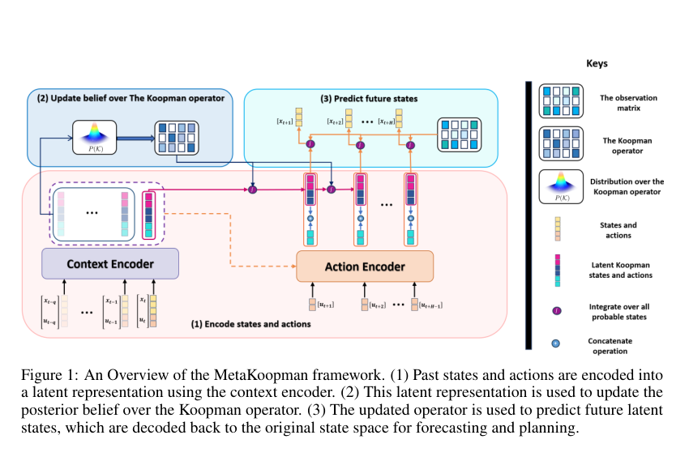

# MetaKoopman：Bayesian Meta-Learning of Koopman Operators for Modeling Structured Dynamics under Distribution Shifts

**作者**: Mahmoud Selim, Sriharsha Bhat, Karl H. Johansson  
**会议/期刊**: NeurIPS 2025  
**arXiv**: [2607.26345](https://arxiv.org/abs/2607.26345)  
**代码/项目页**: [项目主页](https://mahmoud-selim.github.io/MetaKoopman/) · [GitHub](https://github.com/Mahmoud-Selim/MetaKoopman)  
**领域**: 分布变化下的动力学建模、Bayesian meta-learning、概率预测  
**关键词**: MNIW prior, online adaptation, uncertainty, context encoder

{ width="100%" }

<figcaption class="figure-caption">原论文 Figure 1 的框架截取：历史状态和动作编码成上下文，用于更新 Koopman 算子后验，再预测未来状态。</figcaption>

## 一句话总结

论文把 Koopman 算子视为任务相关的随机变量：元训练阶段学习跨环境共享的
MNIW 先验，部署时只用近期轨迹进行闭式 Bayesian 更新，并传播未来预测的不确定性。

## 研究背景与动机

- **领域现状**：Koopman 模型便于高效多步预测和控制，但多数模型在测试时保持固定，难以适应动力学变化。
- **现有痛点**：在线梯度更新成本高且不稳定；只输出一个算子点估计无法区分观测噪声和算子不确定性。
- **核心矛盾**：既要保留线性潜动力学的计算效率，又要在新环境中用极少数据快速改变动力学信念。
- **本文目标**：学习可跨任务复用的算子先验；用少量上下文闭式更新后验，并产生概率预测。
- **切入角度**：不在测试时重新训练整个网络，而是把适配问题转成小型 Bayesian 线性回归。
- **核心 idea**：表示网络负责把历史压成有时间上下文的潜状态，算子后验负责吸收当前环境证据。

## 方法详解

### 整体框架

每个任务是一段特定环境下的轨迹，分为支持集和查询集。上下文编码器将历史状态
和动作编码成潜序列，并拆分状态潜变量 \(\xi_t\) 与控制潜变量 \(\upsilon_t\)：

$$
[\widetilde z_{t-q},\ldots,\widetilde z_t]
=G_\theta(x_{t-q},u_{t-q},\ldots,x_t,u_t),
\qquad \widetilde z_t=\begin{bmatrix}\xi_t\\\upsilon_t\end{bmatrix}.
$$

线性潜动力学和观测为

$$
\xi_{t+1}=K\widetilde z_t+\epsilon_t,
\qquad \widehat x_{t+1}=C\xi_{t+1},
\qquad \epsilon_t\sim\mathcal N(0,\Sigma).
$$

数据流是：

```text
历史状态/动作 → context encoder → 支持集潜转移
→ 更新 Koopman 后验 → 未来动作编码 → 概率预测 → 观测矩阵解码
```

### 关键设计

**1. 历史上下文编码器**

- **功能**：把多个过去时刻的状态-动作对压成具有时间上下文的潜表示。
- **核心思路**：使用窗口 \([x_{t-q:t},u_{t-q:t}]\)，而不是只编码单个状态-动作对；未来动作由动作编码模块生成或编码。
- **设计动机**：同一个当前状态在不同环境下可能有不同动力学，历史变化提供了识别当前环境的证据。

历史窗口改变了状态定义：如果图代理也需要历史，必须明确它是 history-dependent
representation，而不是假装只依赖当前节点状态。

**2. MNIW 共轭先验和闭式后验**

给定支持集中的潜转移对，令 \(Z=[z_1,\ldots,z_N]\)、
\(Y=[\xi_2,\ldots,\xi_{N+1}]\)，建立矩阵回归 \(Y\approx KZ\)。采用统一的精度
记号，先验为

$$
K\mid\Sigma\sim\mathcal{MN}(M_0,\Sigma,\Lambda_0^{-1}),
\qquad \Sigma\sim\mathcal{IW}(\Psi_0,\nu_0).
$$

后验参数更新为：

$$
\Lambda_N=\Lambda_0+ZZ^\top,
\qquad
M_N=(YZ^\top+M_0\Lambda_0)\Lambda_N^{-1},
\qquad
\nu_N=\nu_0+N,
$$

$$
\Psi_N=\Psi_0+YY^\top+M_0\Lambda_0M_0^\top-M_N\Lambda_NM_N^\top.
$$

固定潜表示后，更新只涉及潜空间统计量和正定线性系统求解。实现时应使用
Cholesky 等稳定求解，不显式求逆；这里的矩阵维度是潜空间维度，不是大图矩阵。

**3. 后验预测与不确定性传播**

给定潜回归向量 \(z\)，一步预测均值为 \(M_Nz\)，其协方差包含过程噪声和算子
不确定性：

$$
\mathbb E[\xi_{\mathrm{next}}\mid z,\mathcal D]=M_Nz,
$$

$$
\operatorname{Cov}(\xi_{\mathrm{next}}\mid z,\mathcal D)
=\left(1+z^\top\Lambda_N^{-1}z\right)
\frac{\Psi_N}{\nu_N-q-1}.
$$

多步预测递推传播均值和协方差，并在每一步做 Gaussian moment matching。这是有效
的近似，不应被称为复用未知算子时的精确长序列联合后验。

**4. 元训练与部署适配分离**

元训练阶段从多个任务采样支持集和查询集，利用查询预测负对数似然更新共享编码器、
观测矩阵和先验参数。部署时冻结共享参数，只用新环境的近期历史更新后验，再进行
未来预测。该分离让测试期的适配开销集中在低维统计量上。

### 算法伪代码

```text
输入：任务分布 rho(T)，每个任务的历史支持集和未来查询集
初始化：共享上下文编码器、观测矩阵和 MNIW 先验参数

元训练：
    重复直到收敛：
        采样一批任务
        对每个任务：
            用历史状态/动作编码支持集潜转移 Z, Y
            按 MNIW 共轭公式更新 M_N, Lambda_N, Psi_N, nu_N
            编码查询期未来动作
            用后验算子递推查询期潜状态并解码
            计算查询预测负对数似然
        反向传播更新共享表示、观测矩阵和先验

部署：
    冻结共享参数
    用新客户端最近轨迹构造 Z, Y
    闭式更新该客户端的 Koopman 后验
    传播未来潜状态的均值/协方差并解码
```

## 对异质图联邦学习的可借鉴思路

**第一，把客户端看成不同动力学任务，而不是待平均的同质样本。** 在表示已经
验证可靠之后，可将客户端 \(m\) 的本地轨迹视为任务 \(\mathcal T_m\)，让共享先验
描述跨客户端可复用的算子不确定性，本地轨迹负责更新后验。这比把每个客户端的
\(K_m\) 直接加权平均更符合特征、结构和传播参数共同变化的异质环境。

**第二，聚合充分统计量而不是原始算子。** 在有公共潜坐标或显式 transport
\(T_m\) 时，客户端可以在本地构造

$$
S_m=Z_mZ_m^\top,\qquad R_m=Y_mZ_m^\top,
$$

再安全聚合 \(\sum_m p_mS_m\) 和 \(\sum_m p_mR_m\)，或仅由服务器维护先验更新。
这对应凸 ridge 目标

$$
\min_K\sum_m p_m\|Y_m-KZ_m\|_F^2+\lambda\|K-M_0\|_F^2,
$$

而不是对未对齐的矩阵做 FedAvg。若客户端坐标不同，必须先在公共 probe 响应或
功能 transport 坐标中对齐，再讨论这些统计量能否合并。

**第三，让后验不确定性参与知识流动和门控。** 当某客户端只有少量支持轨迹，
后验协方差较大，服务器不应把它的算子当成确定知识强行发送给其他客户端。后续可
根据预测响应的置信区间、任务增益和本地适配代价学习接收门控，保留必要的个性化
动力学，而不是设置与图结构无关的固定阈值。

**第四，历史编码可以识别隐含环境，但会扩大交换对象。** 如果客户端结构变化不能
由当前 \(H_t^m) 区分，历史窗口或图统计量可能帮助识别环境；代价是通信和缓存的
对象从单状态潜码变成历史条件。这个设计必须通过消融确认确实带来动力学识别收益。

## 局限与使用边界

- Bayesian 适配假设潜表示已经可用；它不能替代低维编码器和跨客户端坐标对齐。
- MNIW 共轭更新依赖线性回归结构和正定先验，模型不匹配时后验仍可能产生误导性不确定性。
- 共享先验不等于共享语义；独立编码器下的相同潜维度没有天然对应关系。
- 论文的控制和连续动作场景不能直接等价为图联邦知识迁移；图结构和节点置换需要单独建模。
