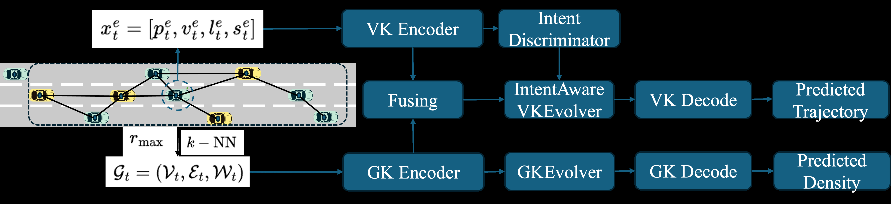

# Micro-Macro Coupled Koopman Modeling on Graph for Traffic Flow Prediction

**作者**: Bairan Xiang, Chenguang Zhao, Huan Yu  
**会议/期刊**: ICLR 2026  
**代码**: 论文称将在发表后提供匿名仓库；当前 PDF 未给出公开代码链接  
**领域**: 交通流建模、车辆中心动态图、Koopman 算子、图上的 PDE 离散化  
**关键词**: MMCKM、LWR、advection-diffusion、intent discriminator、Koopman control

{ width="100%" }

<figcaption class="figure-caption">原论文 Figure 1 的框架截取：车辆组成动态有向图，宏观分支预测密度，微观分支根据驾驶意图选择 Koopman 演化器，并通过 CrossAttention 接收宏观流量控制。</figcaption>

## 一句话总结

MMCKM 把交通系统拆成两个相互影响的尺度：车辆轨迹是微观状态，车辆周围的密度场是
宏观状态。宏观侧在以车辆为节点的动态图上离散 LWR 对流-扩散方程，微观侧用多个
带稳定性约束的 Koopman 演化器建模不同驾驶意图，再用 Koopman control 将宏观流量
作为输入注入车辆动力学。整个推理只需当前时刻的车辆图和自车状态，不依赖数秒历史轨迹。

## 研究背景与动机

- **领域现状**：微观模型能表示跟车、变道等局部行为，但难以约束整体流量；宏观模型能描述守恒和波传播，却会平均掉车辆级扰动。
- **现有痛点**：固定欧氏网格的 PDE 离散把车辆扰动平均在网格单元中；历史依赖的轨迹模型还需要持续跟踪和缓存长序列。
- **核心矛盾**：需要同时保留高频车辆扰动、宏观守恒结构和不同驾驶模式，又要支持实时多步预测。
- **本文目标**：在车辆中心的拉格朗日图上构造物理一致的宏观算子，并让它和微观车辆 Koopman 模型双向耦合。
- **切入角度**：把宏观密度和微观轨迹都提升到有限维观测空间，在观测空间里用线性算子推进。
- **核心 idea**：微观车辆通过扩散影响宏观流量，宏观流量通过受控 Koopman 项反过来影响车辆；Intent Discriminator 负责在多种驾驶模式之间切换。

## 符号和维度

| 符号 | 维度/取值 | 含义 |
| --- | --- | --- |
| \(\mathcal G_t=(\mathcal V_t,\mathcal E_t,\mathcal W_t)\) | 动态有向图 | 时刻 \(t\) 的车辆中心图 |
| \(N\) | 感知范围内车辆数 | 图节点数，随时间变化 |
| \(\mathbf x_i^t\) | \([\mathbf p_i^t,\mathbf v_i^t,l_i^t,s_i]\) | 车辆 \(i\) 的位置、速度、车道和尺寸类别 |
| \(\widehat{\boldsymbol\rho}_t\) | \(N\) | 每辆车位置处的局部交通密度 |
| \(\mathbf B_t\) | \(M\times N\) | 图关联矩阵，\(M=|\mathcal E_t|\) |
| \(\mathbf W_{\mathrm{diff}},\mathbf W_{\mathrm{adv}}\) | \(M\times M\) | 扩散和对流边权 |
| \(\mathbf L_{\mathrm{diff}},\mathbf C_{\mathrm{adv}}\) | \(N\times N\) | 图上的扩散和对流算子 |
| \(\mathbf Z_t\) | \(d_Z\) | 宏观 Koopman 观测 |
| \(\mathbf z_t\) | \(d_z\) | 微观自车 Koopman 观测 |
| \(K_Z\) | \(d_Z\times d_Z\) | 宏观线性演化矩阵 |
| \(K_z,B_z\) | \(d_z\times d_z\)、\(d_z\times d_u\) | 微观 Koopman 演化和控制矩阵 |
| \(u_t\) | \(d_u\) | CrossAttention 产生的宏观到微观控制量 |
| \(\Delta t\) | 时间间隔 | Koopman 迭代步长/算子区间 |

## 方法详解

### 1. 车辆中心的交通图

自车只能观测半径 \(r_{\max}\) 内的车辆。每个时刻构造
\(\mathcal G_t=(\mathcal V_t,\mathcal E_t,\mathcal W_t)\)：节点是车辆，边由欧氏距离
的 \(k\)-NN 建立，边权由车辆状态经过两个 GNN 分别预测。关联矩阵
\(\mathbf B_t\in\mathbb R^{M\times N}\) 约定：若边 \(e\) 从车辆 \(j\) 指向车辆 \(i\)，
该行在 \(j\) 和 \(i\) 位置分别取相反符号。于是

$$
(\mathbf B_t\widehat{\boldsymbol\rho}_t)_e
=\widehat\rho_j-\widehat\rho_i
$$

是沿边的密度差，\(\mathbf B_t^\top\) 把边通量散回节点，扮演图上的散度。
这使得宏观 PDE 可以在不固定欧氏网格的情况下直接作用于车辆节点。

### 2. 宏观侧：在图上离散 LWR 对流-扩散

传统 LWR 交通流方程是

$$
\frac{\partial \rho}{\partial t}+\nabla\cdot Q(\rho)=0,
\qquad Q(\rho)=\rho\,v(\rho).
$$

MMCKM 令 \(\widehat{\boldsymbol\rho}_t\) 为车辆位置上的密度向量，并将通量拆成
对流和扩散两部分：

$$
\dot{\widehat{\boldsymbol\rho}}
=-\mathbf C_{\mathrm{adv}}\widehat{\boldsymbol\rho}
+\mathbf L_{\mathrm{diff}}\widehat{\boldsymbol\rho},
\qquad
\mathbf C_{\mathrm{adv}}=\mathbf B^\top\mathbf W_{\mathrm{adv}}\mathbf B,
\qquad
\mathbf L_{\mathrm{diff}}=\mathbf B^\top\mathbf W_{\mathrm{diff}}\mathbf B.
$$

这里的正负号沿用论文的算子定义；\(\mathbf L_{\mathrm{diff}}\) 的耗散/增益解释取决于
具体 PDE 符号约定。论文将 \(\mathbf W_{\mathrm{diff}}\) 设为 PSD，使
\(\mathbf L_{\mathrm{diff}}\) 为 PSD，将 \(\mathbf C_{\mathrm{adv}}\) 设为反对称，使
对流项不改变二次能量。

#### 扩散项

边上的扩散通量按 Fick 定律与密度梯度成正比：

$$
\mathbf Q_{\mathrm{diff}}
=\mathbf W_{\mathrm{diff}}\mathbf B\widehat{\boldsymbol\rho},
\qquad
\dot{\widehat{\boldsymbol\rho}}_{\mathrm{diff}}
=\mathbf B^\top\mathbf Q_{\mathrm{diff}}
=\mathbf L_{\mathrm{diff}}\widehat{\boldsymbol\rho}.
$$

若 \(\mathbf W_{\mathrm{diff}}\succeq0\)，则

$$
\widehat{\boldsymbol\rho}^{\top}\mathbf L_{\mathrm{diff}}
\widehat{\boldsymbol\rho}
=
(\mathbf B\widehat{\boldsymbol\rho})^\top
\mathbf W_{\mathrm{diff}}
(\mathbf B\widehat{\boldsymbol\rho})\geq0.
$$

实现中扩散图初始化为无向图，并对 GNN 输出使用 Softplus，使边权非负并保留 PSD 结构。

#### 对流项和反对称参数化

车辆 \(i\) 到 \(j\) 的边方向为

$$
\mathbf d_{ij}
=\frac{\mathbf p_j-\mathbf p_i}{\|\mathbf p_j-\mathbf p_i\|_2}.
$$

若 \(a_{ij}=(\mathbf v_i\cdot\mathbf d_{ij})\,\mathrm dA_{ij}\)，
\(a_{ji}=-(\mathbf v_j\cdot\mathbf d_{ij})\,\mathrm dA_{ji}\)，则边上的净对流通量为

$$
Q_{ij}
=a_{ij}\widehat\rho_i-a_{ji}\widehat\rho_j
=\frac12(\widehat\rho_i-\widehat\rho_j)(a_{ij}+a_{ji})
+\frac12(\widehat\rho_i+\widehat\rho_j)(a_{ij}-a_{ji}).
$$

论文保留依赖密度差的部分，把第一项写成
\(\mathbf W_{\mathrm{adv}}\mathbf B\widehat{\boldsymbol\rho}\)。为保证守恒和能量保持，
它先建立边的 line graph。令 \(\mathbf A_{\mathrm{line}}\in\{0,1\}^{M\times M}\)
表示两条边是否共享节点，局部掩码为

$$
\mathbf M_{\mathrm{loc}}
=\frac12\bigl(\mathbf A_{\mathrm{line}}
+\mathbf A_{\mathrm{line}}^\top-\mathbf I\bigr).
$$

对无约束参数 \(\mathbf P\in\mathbb R^{M\times M}\)，定义

$$
\mathbf W_{\mathrm{adv}}
=\mathbf M_{\mathrm{loc}}\odot(\mathbf P-\mathbf P^\top),
\qquad
\mathbf C_{\mathrm{adv}}
=\mathbf B^\top\mathbf W_{\mathrm{adv}}\mathbf B.
$$

由于 \(\mathbf W_{\mathrm{adv}}^\top=-\mathbf W_{\mathrm{adv}}\)，有
\(\mathbf C_{\mathrm{adv}}^\top=-\mathbf C_{\mathrm{adv}}\)。同时
\(\mathbf B\mathbf 1=0\)，因此对流项满足总密度守恒：

$$
\mathbf 1^\top\dot{\widehat{\boldsymbol\rho}}_{\mathrm{adv}}=0.
$$

### 3. 宏观 Koopman 编码、演化和解码

两个 GNN 根据当前车辆图产生边权后，宏观分支把图提升到观测空间：

$$
\mathbf Z_t=\phi_Z(\mathcal G_t),
\qquad
\mathbf Z_{t+1}=K_Z\mathbf Z_t,
\qquad
\widehat{\boldsymbol\rho}_{t+1}=\psi_Z(\mathbf Z_{t+1}).
$$

其中 \(\phi_Z\) 是图编码器，\(\psi_Z\) 是 MLP 解码器，\(K_Z\) 是可学习的宏观
Koopman 矩阵。训练用当前图预测下一时刻：

$$
\mathcal L_{\mathrm{macro,encode}}
=\left\|\phi_Z(\mathcal G_{t+1})-K_Z\phi_Z(\mathcal G_t)\right\|_2^2,
$$

$$
\mathcal L_{\mathrm{macro,decode}}
=\left\|\widehat{\boldsymbol\rho}_{t+1}
-\boldsymbol\rho_{t+1}\right\|_1.
$$

论文不要求 \(\mathbf L_{\mathrm{diff}}\) 和 \(\mathbf C_{\mathrm{adv}}\) 精确可交换，而是
惩罚它们的换位子：

$$
\mathcal L_{\mathrm{JAD}}
=\left\|\mathbf L_{\mathrm{diff}}\mathbf C_{\mathrm{adv}}
-\mathbf C_{\mathrm{adv}}\mathbf L_{\mathrm{diff}}\right\|_F^2.
$$

这样可以减少 Lie-Trotter 算子分裂时的基底旋转：

$$
\exp\!\bigl(\Delta t(\mathbf L_{\mathrm{diff}}-\mathbf C_{\mathrm{adv}})\bigr)
\approx
\exp(\Delta t\mathbf L_{\mathrm{diff}})
\exp(-\Delta t\mathbf C_{\mathrm{adv}}).
$$

为把 Koopman 动力学和图 PDE 的谱联系起来，定义

$$
\boldsymbol\Theta=\frac1{\Delta t}\log(K_Z).
$$

用 \(\boldsymbol\lambda_L\) 表示 \(\mathbf L_{\mathrm{diff}}\) 的实特征值，
\(\boldsymbol\omega_C\) 表示 \(\mathbf C_{\mathrm{adv}}\) 的纯虚特征值对应的频率，
再用置换矩阵 \(\mathbf\Pi\) 匹配模态，谱对齐损失为

$$
\mathcal L_{\mathrm{spec}}
=\min_{\mathbf\Pi}
\left(
\left\|\operatorname{Re}\lambda(\boldsymbol\Theta)
-\mathbf\Pi\boldsymbol\lambda_L\right\|_2^2
+
\left\|\operatorname{Im}\lambda(\boldsymbol\Theta)
+\mathbf\Pi\boldsymbol\omega_C\right\|_2^2
\right).
$$

矩阵对数用实 Schur 分解计算，并对接近单位圆的特征值加入小的 Tikhonov 正则；
这样即使 \(K_Z\) 不可对角化，也能避免直接求特征向量和数值分支问题。

### 4. 微观侧：带宏观控制的 Koopman 演化

自车状态写成

$$
\mathbf x_t^e=
[\mathbf p_t^e,\mathbf v_t^e,l_t^e,s_t^e].
$$

微观编码器产生
\(\mathbf z_t=\phi_z(\mathbf x_t^e)\)。CrossAttention 融合微观观测
\(\mathbf z_t\) 和宏观观测 \(\mathbf Z_t\)，输出控制输入

$$
\mathbf u_t=\mathrm{CA}(\mathbf z_t,\mathbf Z_t).
$$

微观 Koopman control 演化为

$$
\mathbf z_{t+1}=K_z\mathbf z_t+B_z\mathbf u_t,
\qquad
\widehat{\mathbf p}_{t+1}^e=\psi_z(\mathbf z_{t+1}).
$$

因此宏观流量通过 \(B_z\mathbf u_t\) 影响车辆轨迹；车辆位置改变又会改变下一时刻
的车辆图、密度和宏观图算子，形成双向闭环。

单一 \(K_z\) 难以同时覆盖自由流、跟车、变道、汇入和紧急操作。论文因此使用
Intent Discriminator（MoE）根据当前自车状态和 \(\mathbf Z_t\) 选择候选演化器。
意图标签由加速度、相对车头时距和横向位移的确定性规则生成，再监督训练 MLP 门控。

每个候选 \(K_z\) 由 \(N_c\) 个 \(2\times2\) 复共轭块和 \(N_r\) 个实标量块组成。
复块为

$$
K_c
=R
\begin{bmatrix}
\cos\theta&-\sin\theta\\
\sin\theta&\cos\theta
\end{bmatrix},
\qquad
\lambda_{1,2}=Re^{\pm i\theta}.
$$

对半径使用

$$
R=\rho_{\max}\sigma(\eta),\qquad \rho_{\max}<1,
$$

实块也施加同样的 \(R<1\) 约束，因此 \(\rho(K_z)<1\)。CrossAttention 最终输出
经过 Sigmoid 以保证 \(\mathbf u_t\) 有界，控制矩阵则参数化为

$$
B_z=B_{\max}\tanh(\widetilde B_z).
$$

于是有输入-状态稳定性（ISS）形式的界：

$$
\|\mathbf z_t\|
\leq c\lambda^t\|\mathbf z_0\|
+cB_z\sup_{0\leq\tau\leq t-1}\|\mathbf u_\tau\|,
\qquad 0<\lambda<1.
$$

不同驾驶模式通过 \(\rho_{\max}\)、\(B_{\max}\)、\(\theta_{\mathrm{mean}}\) 和
\(\theta_{\mathrm{std}}\) 注入先验。例如自由流使用接近 1 的半径和接近 0 的振荡；
变道/汇入使用更大的控制上限与非零振荡中心。

微观侧的编码和解码损失为

$$
\mathcal L_{\mathrm{micro,encode}}
=\left\|\phi_z(\mathbf x_{t+1}^e)
-K_z\phi_z(\mathbf x_t^e)\right\|_2^2,
$$

$$
\mathcal L_{\mathrm{micro,decode}}
=\left\|\widehat{\mathbf y}_{t+1}^e
-\mathbf y_{t+1}^e\right\|_2^2.
$$

实际多步预测使用上面的受控项 \(B_z\mathbf u_t\) 递推；训练目标还需和宏观重建、
换位子及谱对齐正则共同加权。

### 5. 从输入到预测的完整流程

~~~text
输入：当前车辆图 G_t、自车状态 x_t^e、检测半径 r_max、k-NN 参数 k

1. 在 r_max 内取车辆节点，用 k-NN 建边并构造关联矩阵 B_t。
2. GNN 根据车辆状态预测 W_diff、W_adv。
3. Softplus 保证扩散边权为非负；line-graph 反对称参数化保证 C_adv^T=-C_adv。
4. 计算 L_diff=B^T W_diff B、C_adv=B^T W_adv B。
5. 宏观编码 Z_t=phi_Z(G_t)，递推 Z_{t+1}=K_Z Z_t，解码下一时刻密度。
6. 将 x_t^e 编码为 z_t；Intent Discriminator 选择当前驾驶模式的 K_z、B_z。
7. CrossAttention 生成 u_t=CA(z_t,Z_t)，递推 z_{t+1}=K_z z_t+B_z u_t。
8. 微观解码得到下一时刻自车轨迹；更新车辆图后继续迭代。

训练同时优化宏观编码/解码、微观编码/解码、JAD 换位子和谱对齐损失。
训练结束后保留 GNN/MLP 编码器、Koopman 矩阵和解码器，推理不需要特征分解。
~~~

### 6. 计算复杂度和算子区间

设每辆车平均 \(k\) 条边、观测维度为 \(d\)、预测 \(T\) 步，论文给出的主要复杂度为

$$
O(kNd+Td^2).
$$

前一项来自稀疏图消息传递，后一项来自低维 Koopman 矩阵迭代；相比每个时间步都做
时空 GNN 或全局注意力，避免了 \(T\) 次大规模时空交互。算子区间 \(\Delta t\) 是重要
超参数：过小会让特征值聚集在单位圆附近、迭代次数过多且数值病态；过大则丢失变道
等高频动作。HighD 实验中 \(0.4\) 秒区间取得最佳 ADE。

## 实验与实证观察

论文使用 NGSIM（10 Hz）和 HighD（25 Hz）高速公路数据，感知区域覆盖自车车道及
两侧车道，前方 90 m、后方 60 m，\(k=6\)，密度用带宽 25 m 的 Gaussian KDE 估计，
宏观和微观观测维度均为 128，Intent Discriminator 包含五种驾驶模式。

| 设置 | 结果 | 观察 |
| --- | --- | --- |
| NGSIM，1 秒算子区间，1 s 预测 | RMSE \(0.54\) | 无历史输入仍优于 history-free CV 的 \(0.64\) |
| NGSIM，0.1 秒算子区间，1 s 预测 | RMSE \(0.33\) | 短期精度接近历史依赖模型 |
| NGSIM，1 秒算子区间，5 s 预测 | RMSE \(2.93\) | 只需 5 次迭代，长程误差更稳 |
| NGSIM，0.1 秒算子区间，5 s 预测 | RMSE \(4.65\) | 50 次迭代导致误差累积 |
| HighD 算子区间比较 | \(0.4\) s 的 ADE \(1.65\) | 在高频保真和数值稳定之间取得平衡 |
| HighD 去掉 Intent | 5 s RMSE \(3.81\) | 多模式门控主要改善短期预测 |
| HighD 去掉 Koopman control | 5 s RMSE \(3.46\) | 宏观到微观控制对长期稳定更重要 |
| HighD 去掉两者 | 5 s RMSE \(4.62\) | 双向耦合共同带来收益 |

去掉扩散项后，NGSIM 的误差从 5 秒 \(9.5\%\)（完整 advection-diffusion）升到
\(14.1\%\)（仅 advection），支持“车辆扰动通过扩散影响宏观流量”的设计。KDE
带宽 25 m 的宏观误差最低；带宽过小会把高频噪声当作扩散信号，带宽过大又会抹掉
真实扰动。

## 对异质图联邦学习的可借鉴思路

**第一，把客户端图的节点和边视为可变化的物理实体。** MMCKM 的车辆中心图天然
允许节点数变化、边随时间重建；在异质图联邦中，可把本地节点状态、关系类型和局部
传播分别送入客户端编码器，不要求所有客户端共享固定节点编号。

**第二，宏观守恒约束可以转成共享验证量。** 对每个客户端，可检查
\(\mathbf 1^\top\dot{\rho}\)、扩散 PSD 性质和对流反对称性，再在公共 probe 响应上
比较 Koopman 预测，而不是只比较上传矩阵的欧氏距离。

**第三，控制项提供了跨尺度知识流动的模板。** 如果客户端有全局图状态和局部节点
任务，可以用 \(B_m u_m\) 表示全局/共享表示对本地动力学的有界影响，并通过
\(\rho(K_m)<1\) 与 \(\|u_m\|\) 上界控制长程漂移。

**第四，多专家结构适合异质客户端。** 不同客户端可能对应不同传播机制；与其平均
一个过度泛化的 \(K\)，可以共享候选算子族和模式先验，让本地门控根据当前图状态选择。
门控必须和任务增益、预测不确定性及通信成本一起验证。

## 局限与使用边界

- 论文把 KDE 密度当作宏观监督，尚未用传感器直接观测的密度标签验证全部结论。
- 车辆感知范围有限，图节点会进出；如何在更大城市网络上稳定维护图状态仍未解决。
- \(\rho(K_z)<1\) 和有界控制给出的是线性观测空间中的稳定性条件，不等于真实车辆一定满足所有安全约束。
- Intent 标签由规则生成，模式切换错误会把不合适的 Koopman 演化器送入闭环。
- 宏观和微观观测空间的语义仍依赖训练数据；跨城市、道路和车辆类型迁移需要重新校准。
- 对异质图联邦学习，矩阵谱、节点置换和关系语义对齐不能由 MMCKM 自动完成。
